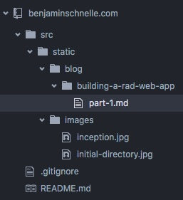

# Building a Rad Web App - Initial Setup

My turn to do something that's been explained a thousand times before...build a web app with React, Redux and Webpack!

We're going to build a simple web app to serve as my plot of land on the interwebs. It'll have generic info about me, a blog, and a place for apps so that after we hack together a unicorn simulator we'll have somewhere to put it.  We'll host it at benjaminschnelle.com (that's me!).

If you're just getting into development, specifically the Javascript ecosystem, it can be overwhelming.  I'm going to do my best to touch briefly on everything I do/use to at least give you an idea of what's going on.  If I forget to explain something just Google it, that's the best resource for anything, ever.

This post is being written from within the project we're building. Whoa.


### What's in our toolbox?
- [Markdown](https://github.com/adam-p/markdown-here/wiki): a neat way to write nicely formatted HTML using only text
- [Git](https://git-scm.com/): version control
- [GitHub](https://github.com/): our Git repository (where our source code lives) host
- [Node](https://nodejs.org/en/): server side Javascript runtime
- [NPM](https://www.npmjs.com/): Node's package manager (fuggin' amazing)
 - go [here](http://www.modulecounts.com/) to checkout how quickly NPM has overtaken other package managers over the last few years
- [ESLint](http://eslint.org/): make sure we write consistent, well-formatted code
- [Webpack](https://webpack.github.io/): module bundler which takes many files and combines them into one or more files...WARNING: docs are no bueno, but this is an absolutely amazing tool
- Testing
 - [Mocha](https://mochajs.org/): testing framework/test runner
 - [Chai](http://chaijs.com/): test assertions (does this equal that?)
 - [Sinon](http://sinonjs.org/): spies, stubs, and mocks (helpers that making testing easier)
 - [Enzyme](http://airbnb.io/enzyme/): Airbnb powered React specific testing utilities
 - [JSDom](https://github.com/tmpvar/jsdom): a JavaScript implementation of the Document Object Model (DOM, the browser)...this creates a fake DOM which allows us to test browser code from the command line (terminal)
- [React](https://facebook.github.io/react/): view layer of our app (just the user interface)
- [Redux](http://redux.js.org/): data layer (state management)
- [Codeship](https://codeship.com): continuous integration/delivery

### Steps we're going to take (they'll all be elaborated on later)
1. Create our project
2. Add version control with Git and use Github as our repo host
3. Install our initial dependencies with Node Package Manager (NPM)
4. Setup ESLint
5. Configure Webpack
6. Add our testing framework
7. Use test driven development (TDD) to build the app (to be expanded)
8. Setup continuous integration/continuous delivery with Codeship

## Let's Boogie

I'll be doing all development from Mac OSX so if you're on a different platform your mileage may vary.  Got any questions? Just ask!

### 1. Create our project
Navigate to wherever you want to put your project and run the commands below.  If those commands look foreign to you they're shell ([bash](https://en.wikipedia.org/wiki/Bash_(Unix_shell)) commands entered through the terminal. Each line is explained below.

```bash
mkdir benjaminschnelle.com
cd benjaminschnelle.com
mkdir src
printf "node_modules\ndist" > .gitignore
printf "Doing stuff, with things. Ben Schnelle HQ." > README.md
```

#### What are those commands doing?
1. Creates a new directory (mkdir = make directory) named "benjaminschnelle.com".  
2. Changes the working directory to the one we just created (cd = change directory).
3. Makes a directory named "src" where our source code will live.
4. Prints two directory names, "node_modules" (where NPM installs packages) and "dist" (where Webpack will spit out its files) into a new file named ".gitignore".  We'll need this file in the next step when we add version control (Git).  It just tells Git to ignore those directories when tracking files.  
5. Creates a new file named "README.md" which is just a nice convention to follow that provides more information about your project.  GitHub will display the contents of this file by default on the homepage of your project.

Now that we have a basic project layout let's go ahead and open it up in an integrated development environment (IDE - supercharged text editor).  If you don't already have one [Atom](https://atom.io/) is a great option provided by GitHub for free.  Open source rocks.

Once you have the project open, add the necessary directories so that your project looks like the one below.  What is important is that you have at least one directory under the "blog" directory with at least one [markdown](https://daringfireball.net/projects/markdown/) file in it with a few lines of text in that file.  You can safely ignore the "images" directory.



### 2. Add version control with Git and use Github as our repo host
To get our version control with Git/GitHub setup you'll need 2 things: Git (install locally) and a GitHub account.  Head over [here](https://git-scm.com/book/en/v2/Getting-Started-Installing-Git) for Git and [here](https://github.com/) to create a GitHub account.

Once you have both, create a new repository on GitHub as described [here](https://help.github.com/articles/create-a-repo/) with whatever name tickles your fancy.  After you have your repository created grab its HTTPS URL (you can use SSH also, but you'll have to create a key) then from the project root run the commands below from your terminal (explained afterwards) plugging in your repository URL in place of mine.

```bash
git init
git add .
git commit -m 'initial commit'
git remote add origin https://github.com/bschnelle/benjaminschnelle.com.git
git push -u origin master
```

#### What's going on above?
1. Initialize Git in the current directory.
2. Stage all files (excluding those in our ".gitignore" file) so that they can be committed.
3. Commit all of our staged files...this creates a snapshot of our project so in the future if we make changes and decide we want to rollback to how things were before we can do so.
4. Set our remote repository to the one we just created on GitHub.  This is where we're going to push our local repo to.  That way if we spill water on our laptop or want to share the repo with someone else it can just be cloned locally from GitHub.  I would encourage you to read more [here](https://git-scm.com/), they do a much better job explaining the benefits than I ever could.
5. Push our local repository to the master branch on GitHub and set the upstream repository to our GitHub repo.  You'll be prompted for your GitHub credentials when this command is run.

If everything worked correctly you should be able to refresh the repo on GitHub and see your local project's files there now!

### 3. Install our initial dependencies with Node Package Manager (NPM)
Great! We have somewhere to put our application code now, but wouldn't it be great if we were able to piggy back off of all of the hard work people have been doing for years?  I agree!  So there are lots of ways we could use other people's code, but the easiest by far, that I know of, is to use NPM.  How do we get NPM?  We install Node.js which comes with NPM!  So cruise over to the [Node](https://nodejs.org/en/) site and follow the installation instructions.

All done?  Awesome.

Let's install stuff!  Wait, how do we do that?  Well first we need to initialize our project with NPM so that we can use it to manage our dependencies.  Run the command below.  It'll ask you a bunch of questions to which you can either accept the default (by pressing enter) or provide your own values.  If you screw something up, don't worry.  You can always change all of the values afterwards.

```bash
npm init
```

This command will generate a `package.json` file in the root of our project containing our answers to the questions asked.  This file is magical.  It is how we'll manage all of our dependencies.  You can either edit it manually or the NPM command line interface (CLI) will edit it for you if you tell it to.  We'll see how to do that shortly.  Here's what I got after I answered some of the questions.

```json
{
  "name": "benjaminschnelle.com",
  "version": "0.1.0",
  "description": "a site about some guy",
  "main": "index.js",
  "scripts": {
    "test": "echo \"Error: no test specified\" && exit 1"
  },
  "repository": {
    "type": "git",
    "url": "git+https://github.com/bschnelle/benjaminschnelle.com.git"
  },
  "author": "Benjamin Schnelle <benjamin.schnelle@gmail.com> (https://github.com/bschnelle)",
  "license": "MIT",
  "bugs": {
    "url": "https://github.com/bschnelle/benjaminschnelle.com/issues"
  },
  "homepage": "https://github.com/bschnelle/benjaminschnelle.com#readme"
}
```

Since we now have our project under version control, you're free to commit anytime you see fit.  There aren't really any downsides to committing frequently and doing so gives you more flexibility if you need to rollback for any reason.  So we'll do a commit here, but going forward I won't state every time I'm making a commit.

```bash
git add .
git commit -m 'initialized NPM'
git push origin master
```
