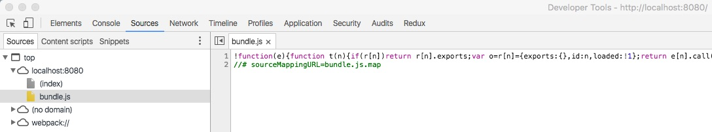
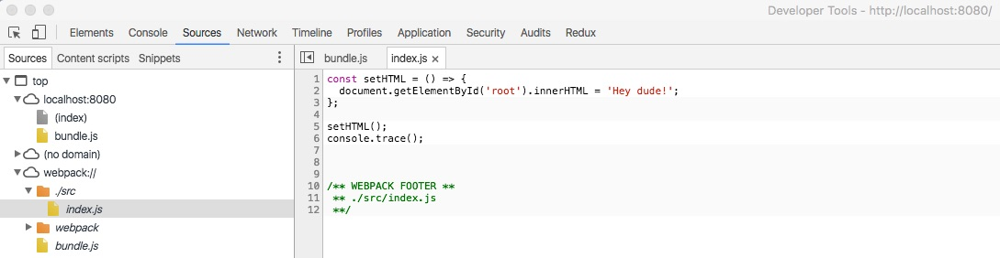

# Building a Rad Web App - Initial Setup Continued...

### As a reminder, here are the steps we're following (starting with #5 here)
1. Create our project
2. Add version control with Git and use Github as our repo host
3. Initialize Node Package Manager (NPM)
4. Setup ESLint
5. Configure Webpack
6. React
7. Add our testing framework
8. Use test driven development (TDD) to build the app (to be expanded)
9. Setup continuous integration/continuous delivery with Codeship

## 5. Configure Webpack
Per the React site, React makes it painless to create interactive UIs.  That is no understatement.  React is all *component* (you can think of them as widgets of functionality) based meaning you break your UI into separate components and *compose* your UI from those components.  I highly recommend reading [Thinking in React](https://facebook.github.io/react/docs/thinking-in-react.html) by [Pete Hunt](https://twitter.com/floydophone) for a quick overview of using React.

Webpack is an amazing bundling tool written with single page applications (SPAs) like the one we're going to build with React and Redux in mind.  Webpack by itself doesn't actually do much, the real power comes from *loaders* and *plugins*.

#### What will we be using Webpack for?
- Development Server: Webpack has a built in development server powered by Node and [Express](https://expressjs.com/) (a web framework for Node)
 - Hot module replacement: edit our application and see the changes in realtime *without* losing the current application state! (it isn't just an automatic page refresh)
- Loaders (put files in, transform them, get bundle out)
 - JSX/ES6/ES7 (React specific syntax and new JavaScript) --> ES5 (old, but well supported JavaScript)
 - SASS (supercharged CSS) --> regular CSS
 - Possibly others, but I'll explain them if we need them
- Plugins (add bundle related functionality)
 - Hot module replacement: necessary for dev server functionality above
 - Minify/Uglify our code
 - Dynamically create our HTML file

Let's get Webpack installed and setup then create a simple script to demonstrate how it works.  Then we'll replace the script with a simple React component to see how that works.  Finally, we'll delete the placeholder component and replace it with our actual application, but I find it helpful to demonstrate ideas with extremely simple, incremental examples.

Let's go ahead and add an "index.html" file to our "src" directory with the code below in it.  This is telling the browser we'll be using English and to use the [UTF-8](http://www.w3schools.com/charsets/ref_html_utf8.asp) character set.  The `<div id="root"></div>` tag is where we'll inject our React app.

```html
<!doctype html>
<html lang="en">
  <head>
    <title>Benjamin Schnelle</title>
    <meta charset="utf-8">
  </head>
  <body>
    <div id="root"></div>
  </body>
</html>
```

Remember that "index.js" file we created in our "src" directory a while ago?  Open that puppy back up and delete its contents then paste in the code below.  We've used the [arrow function](https://developer.mozilla.org/en-US/docs/Web/JavaScript/Reference/Functions/Arrow_functions) ES6 feature here so we can demonstrate how Webpack turns that into ES5.

```javascript
const setHTML = () => {
  document.getElementById('root').innerHTML = 'Hey dude!';
};

setHTML();

```

Ok, so now we have an HTML file that doesn't reference any JavaScript files and a JavaScript file that sets the inner html of our "root" `div` element.  How do we wire the two up?  Well we could just add a script tag to our "index.html" file to pull it in, but that doesn't give us much flexibility.  As stated above, this is another use case for Webpack.  To start we'll just have Webpack inject the script tag for us, but later we'll make it more robust.

Let's setup Webpack now.  Create a new file in the root of your project named "webpack.config.js" with the code below.

```javascript
const path = require('path');
const HtmlWebpackPlugin = require('html-webpack-plugin');

module.exports = {
  entry: './src/index.js',

  module: {
    loaders: [
      {
        test: /\.js$/,
        exclude: /node_modules/,
        loader: 'babel',
      },
    ],
  },

  output: {
    path: path.resolve(__dirname, 'dist'),
    filename: 'bundle.js',
  },

  plugins: [
    new HtmlWebpackPlugin({
      template: './src/index.html',
      inject: 'body',
    }),
  ],
};

```

#### What's going on here?
- [path](https://nodejs.org/api/path.html#path_path_resolve_path) is a Node.js library for resolving file paths
- [HtmlWebpackPlugin](https://github.com/ampedandwired/html-webpack-plugin) lets us dynamically create/augment our HTML file
- entry: where do we want Webpack to enter our application when bundling?
- module: options affecting our modules (JS/JSX/SASS/etc. files)
 - loaders: we talked about these earlier, remember?
    - test: which files do we want this loader to apply to ([RegEx](https://developer.mozilla.org/en-US/docs/Web/JavaScript/Guide/Regular_Expressions) based)
    - exclude: ignore files that match this RegEx
    - loader: the actual loader to use to transform the matched files
- output: where do we want Webpack to spit out the files it creates?
 - path: directory to put the file(s) in (must be an absolute path)
 - filename: what do want to call our file(s)? (here we're only creating a single file)
- plugins: also talked about these earlier
 - HtmlWebpackPlugin
   - template: starting point for our HTML file
   - inject: add a script tag to the `body` section of our "index.html" file pointing to "bundle.js"

So we're looking for files with a ".js" file extension, that are *not* in the "node_modules" folder and then transforming them with the `babel` loader (we could also write it as `loader: 'babel-loader'`).  [Babel](https://babeljs.io/) is a powerful tool for transforming JavaScript and the `babel` loader is just a way to use Babel with Webpack.  In order for Babel to do any transforms we need to tell it what transforms we want applied.  This is specified with Babel plugins or presets (groups of plugins).  You can do configure Babel a few different ways: add a `"babel": {}`  section to your "package.json" file, specify it in your "webpack.config.js", or using a ".babelrc" file.  We'll use the last option, so create a file named ".babelrc" with the contents below.

```json
{
  "presets": [ "es2015", "react", "stage-0" ]
}
```
#### Presets
- es2015: turn new JS into old JS
- react: turn JSX into old JS (we'll need this a little later)
- stage-0: turn more new JS into old JS

We're using a bunch of packages that we haven't yet installed, let's do that now.  You'll see webpack installed twice, once locally, then again globally (with the `-g` option).  We need it installed locally because we'll need to use the package directly a little later and we need it installed globally so that we can use it from the command line.  Additionally, we need to install `webpack-dev-server` globally so that we can serve up our application (it creates a small Node.js web server).

```bash
npm install --save webpack babel-core babel-loader babel-preset-es2015 babel-preset-react babel-preset-stage-0
npm install -g webpack webpack-dev-server
```

Go ahead and run the following command from the root of your project which bundles up our application files, start the development serve, and tells the server to serve the contents of the "dist" folder.  You should now be able to open your browser and visit localhost:8080 to see your app.  If it worked correctly you should see "Hey dude!".

```bash
webpack-dev-server --content-base dist/
```

What just happened?  We started our `webpack-dev-server` which bundled up our application code into a file named "bundle.js", put that in the "dist" folder, copied our src/index.html file into the "dist" folder, and then inserted a script tag into that file to pull in "bundle.js" at runtime.  Awesome!

Hold on a minute.  I don't see a folder named "dist" in my project though.  That's because it is all done in memory!  Want to see the files with your own eyes?  Hop back over to the command line and kill the server with control + C.  Now run the command below, then jump back to your text editor after it finishes....voila, there it is!

```bash
webpack
```

Let's get even crazier.  Go ahead and open up the "bundle.js" file in the "dist" directory.  It's pretty ugly and has 75+ ESLint errors, let's fix those first.  Create a new file in the root of your project called ".eslintignore" and paste in the text below.

```
dist
```

This tells ESLint to ignore everything in the "dist" directory.  If it doesn't fix your errors try reopening the "bundle.js" file.  

The first 40 lines or so are all Webpack related stuff for module caching so that we don't load modules more than once during production use.  If you scroll to the bottom you'll see our application code that just adds "Hey dude!" to a div, but look a little closer.  Our arrow function is gone and has been replaced by a regular function.  That's the ES6 --> ES5 transpilation that Webpack and Babel do for us.

Pretty cool, but what about all those comments and whitespace?  We don't want to send all that crap to our users because they don't need it and it's only going to make their downloads take longer.  Let's get rid of it.  Update your "webpack.config.js" file to look like the one below.

```javascript
const path = require('path');
const HtmlWebpackPlugin = require('html-webpack-plugin');
const webpack = require('webpack'); // new

module.exports = {
  entry: './src/index.js',

  module: {
    loaders: [
      {
        test: /\.js$/,
        exclude: /node_modules/,
        loader: 'babel',
      },
    ],
  },

  output: {
    path: path.resolve(__dirname, 'dist'),
    filename: 'bundle.js',
  },

  plugins: [
    new HtmlWebpackPlugin({
      template: './src/index.html',
      inject: 'body',
    }),

    new webpack.optimize.UglifyJsPlugin(), // new
  ],
};

```

Now let's rebuild our application again.

```bash
webpack
```

Open up "bundle.js" again.  It's just a single line now and it's really hard to read, BUT it's really minimal which is great for performance!  So we have two problems now: during development our beautiful ES6 source code now has to be debugged in minified ES5 which is tough to say the least.  If you were to view the source code from you browser's developer tools you would see the same thing.  We can do better.

Add `devtool: 'source-map',` just above the `entry` property of your "webpack.config.js".  This tells Webpack to create a source map which bridges the gap between your source code and the minified code.  Most modern browsers support source maps for debugging...I'm using Chrome, but most browsers should perform similarly.  Fire up your dev server again with `webpack-dev-server --content-base dist/`, open up your browser dev tools, then refresh the page.  If you go to the "Sources" tab of the dev tools window you should see something similar to the images below.

Minified


Original via source maps


If you want to build the source maps to disk you'll need to run the command below.

```bash
webpack --debug
```

For now, I'm going to comment out the UglifyJsPlugin line since it's just going to add overhead during development.  Later when we address deploying our code we'll add it back.

Let's go ahead and add a script to our "package.json" file to make running our dev server easier.  Update your the `scripts` section to resemble the one below.  Now your can run your dev server by just typing `npm start` from the command line.

```json
{
  "start": "webpack-dev-server --content-base dist/",
  "test": "echo \"Error: no test specified\" && exit 1"
}
```

### Stylezzz (CSS)

Wouldn't it be really awesome if we could make our div display "Hey dude!" in blue instead of black?  Hell yeah!  Wouldn't it be even more awesome if we could use something better than regular CSS to write it?  Double hell yeah!

We're going to use SASS to write our styles, convert SASS to CSS, locally scope our classes, bundle, inject our styles in an external style sheet, then import those styles via our "index.html" file.

CSS is global by default meaning if you use a class named ".title" that makes your font blue in one place then want to use another ".title" class in a different part of your app to make the font pink you'll run into a conflict and both titles will be blue or pink, depending on order.  But some really smart guys came up with the idea of [CSS Modules](https://github.com/css-modules/css-modules) which locally scopes all CSS (via the Webpack css-loader) allowing you to use as many different ".title" classes as you want without conflict!

Let's install the necessary packages

```bash
npm install --save node-sass sass-loader css-loader extract-text-webpack-plugin
```

#### Packages
- node-sass: SASS --> CSS
- sass-loader: use node-sass with Webpack
- css-loader: bundle CSS and scope classes locally
- extract-text-webpack-plugin: create a CSS file from bundled CSS

We've got the packages we need, but now we need to tell Webpack to use them.  Update your "webpack.config.js" file to mirror the one below.  We've added new entries to `loaders` and `plugins`.  The new `loaders` entry will match both ".css" and ".scss" files and apply the sass-loader, then css-loader (with modules/local scoping and source maps enabled), and finally the ExtractTextPlugin loader (loaders are applied right to left).  In the `plugins` section we're telling ExtractTextPlugin to name our bundled CSS file "styles.css".

```javascript
const path = require('path');
const ExtractTextPlugin = require('extract-text-webpack-plugin');
const HtmlWebpackPlugin = require('html-webpack-plugin');
// const webpack = require('webpack');

module.exports = {
  devtool: 'source-map',

  entry: './src/index.js',

  module: {
    loaders: [
      {
        test: /\.(js|jsx)$/,
        exclude: /node_modules/,
        loader: 'babel',
      },
      {
        test: /\.(css|scss)$/,
        loader: ExtractTextPlugin.extract('css?modules&sourceMap!sass'),
      },
    ],
  },

  output: {
    path: path.resolve(__dirname, 'dist'),
    filename: 'bundle.js',
  },

  plugins: [
    new ExtractTextPlugin('styles.css'),

    new HtmlWebpackPlugin({
      template: './src/index.html',
      inject: 'body',
    }),

    // new webpack.optimize.UglifyJsPlugin(),
  ],
};

```

Now create a new file named "classes.scss" in the "src" directory and put the code below into it.

```css
.title {
  color: blue;
}
```

Finally, make the changes below to your "index.js" file.  Here we're just doing what we were before and also adding our ".title" class to the "root" div.

```javascript
import classes from './classes.scss';

const setHTML = () => {
  const root = document.getElementById('root');
  root.innerHTML = 'Hey dude!';
  root.className = classes.title;
};

setHTML();

```

Go ahead and fire up your dev server again and enjoy your beautiful blue font.  If you inspect the div we added the ".title" class to you'll see it has been converted to a unique identifier and source maps have been created to map those new classes back to the original classes.
