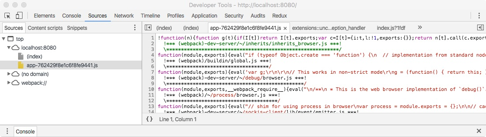
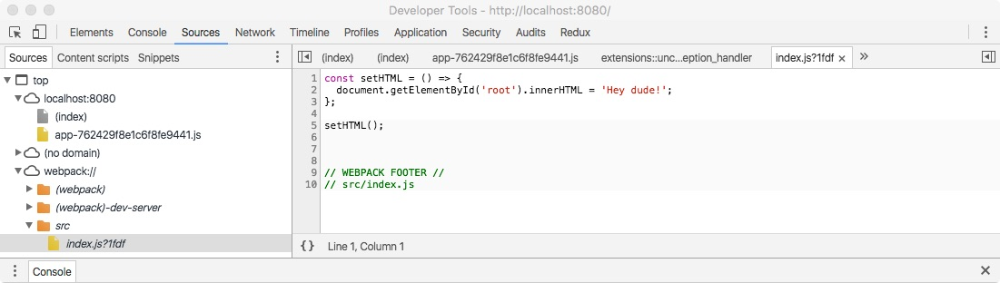

# In Depth Beginner's Guide to the React Ecosystem - Part 2

## 5. Configure Webpack for development
Webpack is an amazing bundling tool written with single page applications (SPAs) like the one we're going to build with React and Redux in mind.  Webpack by itself doesn't actually do much, the real power comes from *loaders* and *plugins*.

#### What will we be using Webpack for during development?
- Web Server: Webpack has a built in development server powered by Node and [Express](https://expressjs.com/) (a web framework for Node)
 - Hot module replacement: edit our application and see the changes in realtime *without* losing the current application state! (it isn't just an automatic page refresh)
- Loaders (put files in, transform them, get bundle out)
 - `babel-loader`: JSX/ES6/ES7 (React specific syntax and new JavaScript)--> ES5 (old, but well supported JavaScript)
 - `postcss-loader`: add browser/vendor prefixes where appropriate (PostCSS does more, but this is what we'll be using it for)
 - `sass-loader`: SASS (supercharged CSS) --> regular CSS
- Plugins (add bundle related functionality)
 - `ExtractTextPlugin`: created CSS bundle
 - `HotModuleReplacementPlugin`: necessary for dev server functionality above
 - `HtmlWebpackPlugin`: dynamically create our HTML file

Let's get Webpack installed and setup then create a simple script to demonstrate how it works.  Go ahead and add an "index.html" file to our "src" directory with the code below in it.  This is telling the browser we'll be using English (`lang="en"`) and to use the [UTF-8](http://www.w3schools.com/charsets/ref_html_utf8.asp) character set (`charset="utf-8"`).  The `<div id="root"></div>` tag is where we'll inject our React app later.

```html
<!doctype html>
<html lang="en">
  <head>
    <title>Benjamin Schnelle</title>
    <meta charset="utf-8">
  </head>
  <body>
    <div id="root"></div>
  </body>
</html>
```

Remember that "index.js" file we created in our "src" directory a while ago?  Open that puppy back up and delete its contents then paste in the code below.  We've used the ES6 [arrow function](https://developer.mozilla.org/en-US/docs/Web/JavaScript/Reference/Functions/Arrow_functions) here to demonstrate how Webpack transpiles ES6 to ES5.

```javascript
const setHTML = () => {
  document.getElementById('root').innerHTML = 'Hey dude!';
};

setHTML();

```

Ok, so now we have an HTML file that doesn't reference any JavaScript files and a JavaScript file that sets the inner html of our "root" `div` element.  How do we wire the two up?  Well we could just add a script tag to our "index.html" file to pull it in, but that doesn't give us much flexibility.  Using the `HtmlWebpackPlugin` we can have webpack dynamically inject `script` and `link` tags for us and also have a hash appended to the name for cache busting (forcing the browser to download a cached file again so we can see our changes)!  Cool!

Let's setup Webpack now.  Create a new file in the root of your project named "webpack.config.js" with the code below.

```javascript
const HtmlWebpackPlugin = require('html-webpack-plugin');
const path = require('path');

module.exports = {
  entry: {
    app: './src/index.js'
  },

  module: {
    loaders: [
      {
        test: /\.js$/,
        exclude: /node_modules/,
        loader: 'babel',
      },
    ],
  },

  output: {
    path: path.resolve(__dirname, 'dist'),
    filename: '[name]-[hash].js',
  },

  plugins: [
    new HtmlWebpackPlugin({
      template: './src/index.html',
      inject: 'body',
    }),
  ],
};

```

#### What's going on here?
- [path](https://nodejs.org/api/path.html#path_path_resolve_path) is a Node.js library for resolving file paths
- [HtmlWebpackPlugin](https://github.com/ampedandwired/html-webpack-plugin) lets us dynamically create/augment our HTML file
- `entry`: where do we want Webpack to enter our application when bundling (use `app` as the bundle's name)?
- `module`: options affecting our modules (JS/JSX/SASS/etc. files)
 - `loaders`: we talked about these earlier, remember?
    - `test`: which files do we want this loader to apply to ([RegEx](https://developer.mozilla.org/en-US/docs/Web/JavaScript/Guide/Regular_Expressions) based)
    - `exclude`: ignore files that match this RegEx
    - `loader`: the actual loader to use to transform the matched files (more on this in a minute)
- `output`: where do we want Webpack to spit out the files it creates?
 - `path`: directory to put the file(s) in (must be an absolute path)
 - `filename`: use the name from `entry` (app) and append a hash to it
- `plugins`: also talked about these earlier
 - `HtmlWebpackPlugin`
   - `template`: starting point for our HTML file
   - `inject`: add a script tag to the `body` section of our "index.html" file pointing to our bundle file

So we're looking for files with a ".js" extension, that are *not* in the "node_modules" folder and then transforming them with the `babel` loader (we could also write it as `loader: 'babel-loader'`).  [Babel](https://babeljs.io/) is a powerful tool for transforming JavaScript and the `babel` loader is just a way to use Babel with Webpack.  In order for Babel to do any transforms we need to tell it what transforms we want applied.  This is specified with Babel plugins or presets (groups of plugins).  You can configure Babel a few different ways: add a `"babel": {}`  section to your "package.json" file, specify it in your "webpack.config.js", or using a ".babelrc" file.  We'll use the last option, so create a file named ".babelrc" in the project root with the contents below.

```json
{
  "presets": [ "es2015", "react", "stage-0" ]
}
```

#### Presets
- es2015: ES6 --> ES5
- react: JSX --> ES5
- stage-0: experimental ES7 --> ES5

We're using a bunch of packages that we haven't yet installed, let's do that now.  You'll see webpack installed twice, once locally, then again globally (with the `-g` option).  We need it installed locally because we'll need to use the package directly a little later and we need it and `webpack-dev-server` (Node.js web server) installed globally so that we can use them from the command line.

```bash
npm install --save webpack babel-core babel-loader babel-preset-es2015 babel-preset-react babel-preset-stage-0
npm install -g webpack webpack-dev-server
```

Go ahead and run the following command from the root of your project then open your browser and visit localhost:8080 to see your app.  If it worked correctly you should see "Hey dude!".

```bash
webpack-dev-server --content-base dist/
```

What just happened?  We started our `webpack-dev-server` which bundled up our application code into a file named something like "app-42d809adf5fa9e5d6ac5.js", put that in the "dist" folder, copied our src/index.html file into the "dist" folder, and then inserted a script tag into that file to pull in the JS bundle at runtime.  Awesome!

Hold on a minute.  I don't see a folder named "dist" in my project though.  That's because it is all done in memory!  Want to see the files with your own eyes?  Hop back over to the command line and kill the server with control + C.  Now run the command below, then jump back to your text editor after it finishes....voila, there it is!

```bash
webpack
```

Let's get even crazier.  Go ahead and open up the "app-42d809adf5fa9e5d6ac5.js" file in the "dist" directory.  It's pretty ugly and has 75+ ESLint errors, let's fix those first.  Create a new file in the root of your project called ".eslintignore" and paste in the text below.

```
dist
```

This tells ESLint to ignore everything in the "dist" directory.  If it doesn't fix your errors try reopening the file.  

The first 40 lines or so are all Webpack related stuff for module caching so that we don't load modules more than once.  If you scroll to the bottom you'll see our application code that just adds "Hey dude!" to a div, but look a little closer.  Our arrow function is gone and has been replaced by a regular function.  That's the ES6 --> ES5 transpilation that Webpack and Babel do for us.

Pretty cool, but what about all those comments and whitespace?  We don't want to send all that crap to our users because they don't need it and it's only going to make their downloads take longer.  Let's get rid of it.  Update your "webpack.config.js" file to look like the one below.

```javascript
const HtmlWebpackPlugin = require('html-webpack-plugin');
const path = require('path');
const webpack = require('webpack'); // new

module.exports = {
  entry: {
    app: './src/index.js'
  },

  module: {
    loaders: [
      {
        test: /\.js$/,
        exclude: /node_modules/,
        loader: 'babel',
      },
    ],
  },

  output: {
    path: path.resolve(__dirname, 'dist'),
    filename: '[name]-[hash].js',
  },

  plugins: [
    new HtmlWebpackPlugin({
      template: './src/index.html',
      inject: 'body',
    }),

    new webpack.optimize.UglifyJsPlugin(), // new
  ],
};

```

Now let's rebuild our application again.

```bash
webpack
```

Open up "bundle.js" again.  It's just a single line now and it's really hard to read, BUT it's really minimal which is great for performance!  So we have two problems now: during development our beautiful ES6 source code now has to be debugged in minified ES5 which is tough to say the least.  If you were to view the source code from you browser's developer tools you would see the same thing.  We can do better.

Add `devtool: 'source-map',` just above the `entry` property of your "webpack.config.js" file.  This tells Webpack to create a source map which bridges the gap between your source code and the transpiled/minified code.  Most modern browsers support source maps for debugging...I'm using Chrome, but most browsers should perform similarly.  Fire up your dev server again with `webpack-dev-server --content-base dist/`, open up your browser dev tools, then refresh the page.  If you go to the "Sources" tab of the dev tools window you should see something similar to the images below.

Minified


Original via source maps


If you want to build the source maps to disk you'll need to run the command below.

```bash
webpack --debug
```

For now, I'm going to comment out the UglifyJsPlugin line since it's just going to add overhead during development.  Later when we setup our production build we'll add it back.

Let's go ahead and add a script to our "package.json" file to make running our dev server easier.  Update the `scripts` section to resemble the one below.  Now you can fire up your dev server by running `npm start` from the command line.

```json
{
  "start": "webpack-dev-server --content-base dist/",
  "test": "echo \"Error: no test specified\" && exit 1"
}
```

### Stylezzz (CSS)

Wouldn't it be really awesome if we could make our div display "Hey dude!" in blue instead of black?  Hell yeah!  Wouldn't it be even more awesome if we could use something better than regular CSS to write it?  Double hell yeah!

We're going to use SASS to write our styles, convert SASS to CSS, add vendor prefixes, locally scope our classes, bundle our styles into an external style sheet, then import those styles via our "index.html" file.

CSS is global by default meaning if you use a class named ".title" that makes your font blue in one place then want to use another ".title" class in a different part of your app to make the font pink you'll run into a conflict and both titles will be blue or pink, depending on order.  But some really smart guys came up with the idea of [CSS Modules](https://github.com/css-modules/css-modules) which locally scopes all CSS (via the Webpack css-loader) allowing you to use as many different ".title" classes as you want without conflict!

Let's install the necessary packages

```bash
npm install --save node-sass sass-loader postcss-loader autoprefixer css-loader extract-text-webpack-plugin
```

#### Packages
- node-sass: SASS --> CSS
- sass-loader: use node-sass with Webpack
- postcss-loader: tool to perform various transforms on CSS, we're using it to apply vendor prefixes with autoprefixer
- autoprefixer: vendor prefixes
- css-loader: bundle CSS and scope classes locally
- extract-text-webpack-plugin: create a CSS file from bundled CSS

We've got the packages we need, but now we need to tell Webpack to use them.  Update your "webpack.config.js" file to mirror the one below.  We've added new entries to `loaders` and `plugins`.  The new `loaders` entry will match both ".css" and ".scss" files and apply the sass-loader, then css-loader (with modules/local scoping and source maps enabled), and finally the ExtractTextPlugin loader (loaders are applied right to left).  In the `plugins` section we're telling ExtractTextPlugin to name our bundled CSS file "styles-ecb5dd1230609d11ec6b295438519a2d.css".

```javascript
const autoprefixer = require('autoprefixer');
const ExtractTextPlugin = require('extract-text-webpack-plugin');
const HtmlWebpackPlugin = require('html-webpack-plugin');
const path = require('path');
// const webpack = require('webpack');

module.exports = {
  devtool: 'source-map',

  entry: {
    app: './src/index.js'
  },

  module: {
    loaders: [
      {
        test: /\.js$/,
        exclude: /node_modules/,
        loader: 'babel',
      },
      {
        test: /\.(css|scss)$/,
        loader: ExtractTextPlugin.extract('css?modules&sourceMap&importLoaders=1!postcss!sass'), // TODO provide description of what this is doing...importLoaders is necessary to use postcss with css modules...add minimize param during production
      },
    ],
  },

  output: {
    path: path.resolve(__dirname, 'dist'),
    filename: '[name]-[hash].js',
  },

  plugins: [
    new ExtractTextPlugin('styles-[contenthash].css'), // new

    new HtmlWebpackPlugin({
      template: './src/index.html',
      inject: 'body',
    }),

    // new webpack.optimize.UglifyJsPlugin(),
  ],

  postcss: [autoprefixer], // new
};

```

Now create a new file named "classes.scss" in the "src" directory and put the code below into it.

```css
.title {
  color: blue;
}
```

Finally, make the changes below to your "index.js" file to add our ".title" class.

```javascript
import classes from './classes.scss';

const setHTML = () => {
  const root = document.getElementById('root');
  root.innerHTML = 'Hey dude!';
  root.className = classes.title;
};

setHTML();

```

Go ahead and fire up your dev server again and enjoy your beautiful blue font.  If you inspect the div we added the ".title" class to you'll see it has been converted to a unique identifier and source maps have been created to map those new classes back to the original classes.

### Hot Module Replacement (HMR)
Currently if you make changes to your source code while your development server is running you have to manually refresh your browser to see the changes.  That's entirely too much work, let's make it update automagically.

HMR is a feature of Webpack that lets us inject updated modules into our running application without a page refresh (via [websockets](https://developer.mozilla.org/en-US/docs/Web/API/WebSockets_API)).  This allows us to make changes to our running application *without* losing the application's state!  If that doesn't make any sense to you, don't worry, let's look at an example.

First we'll add auto-refreshing then we'll add HMR to demonstrate the differences.  Remember how we installed `webpack-dev-server` globally earlier?  Now we need to install it locally as well, so let's go ahead and do that and save it in `devDependencies`.  In order to use auto-refreshing and HMR Webpack needs to add a little code to our bundle.

```bash
npm install --save-dev webpack-dev-server
```

Update the `entry` property of your "webpack.config.js" file as shown below.

```javascript
{
  // more config...
  entry: {
    bundle: [
      'webpack-dev-server/client?http://localhost:8080/',
      './src/index.js',
    ],
  }
  // more config...
}
```

Go ahead and restart your dev server, refresh your browser, then change "Hey dude!" to "Hey man!" and save your file.  Your browser should refresh itself now.  Neat!

What if we had a text input on the page though?  Let's see what happens in that case.  Go ahead and update your "index.html" file as shown below.

```html
<!doctype html>
<html lang="en">
  <head>
    <title>Benjamin Schnelle</title>
    <meta charset="utf-8">
  </head>
  <body>
    <div id="root"></div>
    <input type="text" /> <!-- this is new -->
  </body>
</html>

```

Restart your server, refresh your browser, type something in the text input, then jump back to your "index.js" file and add a few exclamation marks to "Hey man!" and save your file.  If you're watching the browser you should see it refresh, but the value that was in the input is lost.  Bummer.  Let's fix that.

HMR to the rescue!  We need to add a few config options to our "webpack.config.js" file.  Make the changes below.

```javascript
const autoprefixer = require('autoprefixer');
const ExtractTextPlugin = require('extract-text-webpack-plugin');
const HtmlWebpackPlugin = require('html-webpack-plugin');
const path = require('path');
const webpack = require('webpack');

module.exports = {
  // new section
  devServer: {
    hot: true,
  },

  devtool: 'source-map',

  entry: {
    app: [
      'webpack-dev-server/client?http://localhost:8080/',
      'webpack/hot/only-dev-server', // new line
      './src/index.js',
    ],
  },

  module: {
    loaders: [
      {
        test: /\.js$/,
        exclude: /node_modules/,
        loader: 'babel',
      },
      {
        test: /\.(css|scss)$/,
        loader: ExtractTextPlugin.extract('css?modules&sourceMap&importLoaders=1!postcss!sass'), // TODO provide description of what this is doing...importLoaders is necessary to use postcss with css modules...add minimize param during production
      },
    ],
  },

  output: {
    path: path.resolve(__dirname, 'dist'),
    filename: '[name]-[hash].js',
  },

  plugins: [
    new ExtractTextPlugin('styles-[contenthash].css'),

    new webpack.HotModuleReplacementPlugin(), // new line

    new HtmlWebpackPlugin({
      template: './src/index.html',
      inject: 'body',
    }),

    // new webpack.optimize.UglifyJsPlugin(),
  ],

  postcss: [autoprefixer],
};

```

#### What's going on here?  We made 3 changes.
- `devServer`: this property is for config options related to our development server...we add the hot flag so the server knows we want to use HMR
- `entry`: we added `'webpack/hot/only-dev-server'` to add more client code to facilitate HMR which will *not* fallback to auto-refreshing if an HMR update fails...if you would prefer your app to auto-refresh when HMR updates fail add `'webpack/hot/dev-server'` instead
- `plugins`: `new webpack.HotModuleReplacementPlugin()` required for HMR to work

Right, so now we have our Webpack config updated to use HMR, but we need to explicitly enable HMR at the module level of our app.  How do we do that?  Good question.  Let's add a new file named "setHTML.js" to the root of our project and update the contents of "index.js" as shown below.

```javascript
// setHTML.js
import classes from './classes.scss';

const setHTML = () => {
  const root = document.getElementById('root');
  root.innerHTML = 'Hey man!';
  root.className = classes.title;
};

export default setHTML;

```

```javascript
// index.js
import setHTML from './setHTML';

if (module.hot) {
  module.hot.accept('./setHTML', () => {
    // eslint-disable-next-line
    require('./setHTML').default();
  });
}

setHTML();

```

As you can see, we have moved our application logic into a new file named "setHTML.js" and from that file we export our `setHTML` function.  Then in our "index.js" file we import that function and call it at the bottom of the file.  In the middle you'll notice an `if` statement that only fires if some `module` object has a [truthy](http://james.padolsey.com/javascript/truthy-falsey/) `hot` property on it.  Then that function uses some `require` object to load our "setHTML.js" file that we just imported, again.  It then calls a function named `default`.  What the hell.

Let's take it step by step.  First of all, the `export`/`import` statements are part of the ES6 module system (a way to break up your code and access that code between files).  Via Babel, Webpack transpiles those statements to [CommonJS](https://webpack.github.io/docs/commonjs.html) format modules (for better support).  That is where the global objects `module` and `require` come from.  `module.hot` is only defined if HMR is enabled.  The `accept` function is how to tell HMR which modules we want updated when they change, so here we're saying update our app when you detect a change in the "setHTML.js" file (or any of its children).  When you do detect a change go get the updated "setHTML.js" file and call the `default` function on it.  `import` can only be used at the top level of a module which is why we have to use `require` instead and then call the `default` export from the "setHTML.js" module.  The code snippet below equates `import` to `require`.

```javascript
// otherModule.js (this is just for demonstration)
const bark = 'woof';
export { bark }
```

```javascript
// these are the same
import setHTML from './setHTML'; // give me the default export from the setHTML.js file
require('./setHTML').default;

// these are the same
import { bark } from './otherModule'; // give me a named export from otherModule.js
require('./otherModule').bark;
```

Damn Ben, that was a lot of stuff.  What are we even getting out of this?

Restart your dev server and reload your application from the browser.  Type some stuff in your input now, then update your "setHTML.js" file to add/remove a few exclamation marks to "Hey man!" then watch the browser as you save the file.  Your changes come through *AND* your application retains its state! (input doesn't get cleared)  That's awesome!!!  

Ok, maybe you don't think it's that great, but when you're working with application state that takes a while to reach (filling out a form/walking through a wizard) it makes developing/debugging a lot more enjoyable.

#### Misc cleanup
Also, update your "webpack.config.js" file as shown below.  We've added references to `HOST` and `PORT` [environment variables](https://en.wikipedia.org/wiki/Environment_variable) with defaults this way we can dynamically set our host/port combination at runtime.  Notice that we've also added `contentBase: './dist'` to `devServer`?  This means we can remove it from our `start` script in "package.json".  Go ahead and update that to `"start": "webpack-dev-server"`.

```javascript
const autoprefixer = require('autoprefixer');
const path = require('path');
const ExtractTextPlugin = require('extract-text-webpack-plugin');
const HtmlWebpackPlugin = require('html-webpack-plugin');
const webpack = require('webpack');

const host = process.env.HOST || 'localhost';
const port = process.env.PORT || '8080';

module.exports = {
  devServer: {
    contentBase: './dist',
    host,
    hot: true,
    port,
  },

  devtool: 'source-map',

  entry: {
    app: [
      `webpack-dev-server/client?http://${host}:${port}/`,
      'webpack/hot/only-dev-server',
      './src/index.js',
    ],
  },

  module: {
    loaders: [
      {
        test: /\.js$/,
        exclude: /node_modules/,
        loader: 'babel',
      },
      {
        test: /\.(css|scss)$/,
        loader: ExtractTextPlugin.extract('css?modules&sourceMap&importLoaders=1!postcss!sass'),
      },
    ],
  },

  output: {
    path: path.resolve(__dirname, 'dist'),
    filename: '[name]-[hash].js',
  },

  plugins: [
    new ExtractTextPlugin('styles-[contenthash].css'),

    new webpack.HotModuleReplacementPlugin(),

    new HtmlWebpackPlugin({
      template: './src/index.html',
      inject: 'body',
    }),

    // new webpack.optimize.UglifyJsPlugin(),
  ],

  postcss: [autoprefixer],
};

```

#### Summary
We covered a lot here and we'll continue to update our Webpack config in the next section where we add our deployment config.
