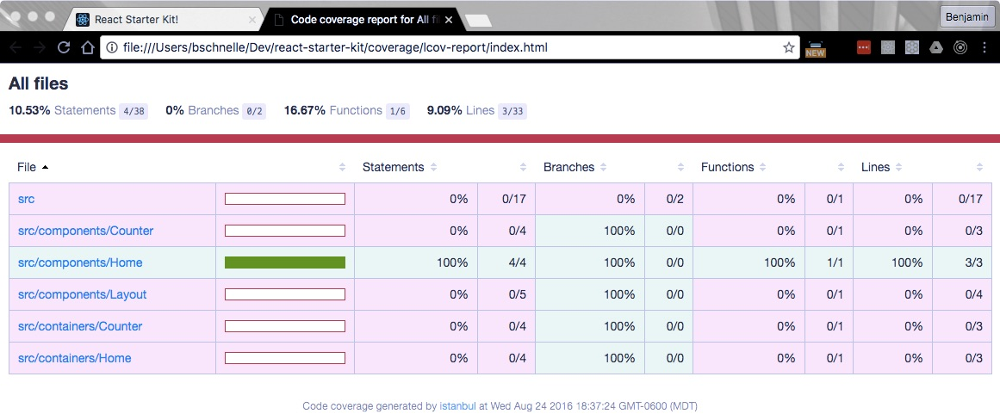

# In Depth Beginner's Guide to the React Ecosystem - Part 5

## 8. Testing setup
Why write tests for our application?  Isn't it just doubling our work?  Please take a moment to read [this](http://stackoverflow.com/a/67500/2482993) stackoverflow answer.  It isn't long and perfectly hits on the benefits.  Convinced?  Me too.

Here's a recap of the tools we'll be using for our testing setup.

#### Tools
- [Mocha](https://mochajs.org/): testing framework/test runner
- [Chai](http://chaijs.com/): test assertions (does this equal that?)
- [Sinon](http://sinonjs.org/): spies, stubs, and mocks (helpers that making testing easier)
- [Enzyme](http://airbnb.io/enzyme/): Airbnb powered React specific testing utilities
- [JSDom](https://github.com/tmpvar/jsdom): a JavaScript implementation of the
- [Istanbul](https://github.com/gotwarlost/istanbul): code coverage...how much of our code has been tested?

Installation!

```bash
npm install --save mocha chai chai-immutable sinon sinon-chai enzyme jsdom istanbul
```

Whoa, wait a second, you slipped two extra libraries in there.  `chai-immutable` lets us make assertions when using Immutable.js (we'll add this in the next part) and `sinon-chai` lets us make more elegant assertions when using `sinon`.

Go ahead and create a "test" folder in the root of your project then create "setup.js" in it.  Paste in the code below.

```javascript
import { jsdom } from 'jsdom';
import chai from 'chai';
import chaiImmutable from 'chai-immutable';
import sinonChai from 'sinon-chai';

// create a fake DOM (browser) in memory
global.document = jsdom('');
global.window = document.defaultView;

Object.keys(window).forEach((key) => {
  if (!(key in global)) {
    global[key] = window[key];
  }
});

// add chai plugins
chai.use(chaiImmutable);
chai.use(sinonChai);

```

The code above creates a fake DOM so that we can test our client code on the server (without a browser).  If you wanted you could also run your test suite from one or more browsers, but it is generally less efficient.  The code creates all of the global variables you would typically find in a browser based JavaScript environment.  At the bottom of the file we're adding our Chai plugins we discussed earlier.

Next we need to provide a few config options to Mocha, our testing framework.  Create a file named "mocha.opts" in the "test" directory.

```
--compilers js:babel-core/register
--compilers jsx:babel-core/register
--require test/setup.js
test/**/*.spec@(.js|.jsx)
```

#### What are these options doing?
- the first two options are telling Mocha to use `babel-core/register` to transpile ".js" and ".jsx" files to ES5 prior to running tests (remember in the testing context Webpack won't be doing anything for us, but we still need to convert our files written in ES6/ES7/JSX to ES5)
- the `require` option is telling Mocha to run the "setup.js" file prior to running the tests
- the last option is a [glob](https://github.com/isaacs/node-glob) which tells Mocha what files to execute as tests...here we're saying find any tests in the "test" directory, at any depth, that end in ".spec.js" or ".spec.jsx".

Given our new testing context, we need to modify a few ESLint rules so that we aren't dealing with linting errors constantly.  Create a new ".eslintrc" file in the "test" folder.

```json
{
  "env": {
    "mocha": true
  },
  "extends" : "../.eslintrc",
  "rules": {
    "no-unused-expressions": 0,
  }
}
```

Here we're starting with our existing ESLint config, setting our environment to Mocha (for certain global variables), and ignoring the "no-unused-expressions" that would throw errors on some of our assertions with Chai.

One final config file we need is ".istanbul.yml" at the *root* of our project as shown below.  This file tells Istanbul that the files we want to test are in our "src" directory, we want to test both ".js" and ".jsx" files, and to include all files with those extensions when determining code coverage.

```yml
instrumentation:
    root: src
    extensions: ['.js', '.jsx']
    include-all-sources: true
```

Now we have all of our config files in place, we just need to create a few scripts in our "package.json" file to make testing easier.  Add the three lines below to the `scripts` sections of your "package.json".  You can delete the placeholder `test` script that was already in there.

```json
{
  "test": "mocha",
  "test:cover": "istanbul cover _mocha",
  "test:dev": "mocha --watch"
}
```

Now we have three testing options: run tests, run tests and generate a code coverage report (we'll see this in a bit), or run tests and rerun them anytime a file is changed.

#### Let's create our first test!  Exciting!  

We'll mirror our "src" directory structure in our "test" directory with test files corresponding to all source files.  Create two new directories for "components" and "containers" then create a file named "App.spec.jsx" in the "components" directory.  The ".spec" extension is just a testing convention.

```javascript
import React from 'react';
import { expect } from 'chai';
import { shallow } from 'enzyme';
import { Link } from 'react-router';
import App from '../../src/components/App';

describe('App', () => {
  it('contains a Link to "/blog"', () => {
    const wrapper = shallow(<App />);
    expect(wrapper.contains(<Link to="/blog">Go to Blog</Link>)).to.be.true;
  });
});

```

Here we're using `shallow` rendering which only renders a component one level deep.  So in this case the `Link` component is not actually evaluated so we can test that the rendered output contains `<Link to="/blog">Go to Blog</Link>` which is exactly what we're doing above.  The `describe` block provides scoping and context, the `it` block is the actual test, and `expect` provides our assertion.  Depending on the outcome of our assertion the test passes or fails.

Jump over to the terminal and run `npm run test:cover` which will execute our test and generate a code coverage report in the root of your project called "coverage".  Your command line output should look similar to the image below.


Before we go any further lets add that directory to our ".gitignore" file so we don't accidentally commit it.

Our code coverage is looking pretty crumby at under 17%, let's take a closer look.  Open up the "index.html" file in coverage/lcov-report.  It should look similar to the image below.  If you click the "src/components" link you'll see that we have 100% coverage on "App.jsx", but everything else is at 0%.  We'll fix that as we go along.



#### Misc
We have a few more items to address before we can call it a day with Redux.  First we want all of our Redux related code grouped in a folder named "redux" in "src".  

Let's commit and close our next GitHub issue.

```bash
git add .
git commit -m 'added React and React Router...closes #7'
git push origin master
```

#### Summary
Our testing setup is looking pretty good and we've written our first test.  Stellar progress!  Going forward we're going to take a Test Driven Development approach to developing our app.
