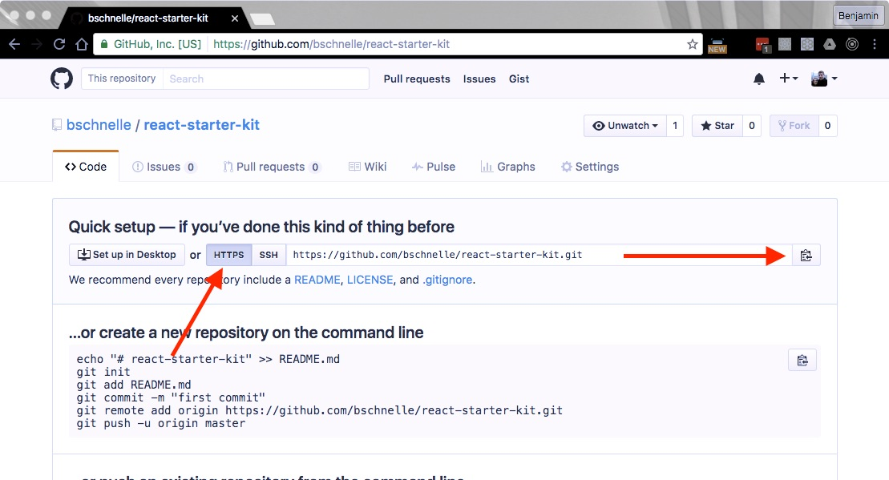

Welcome to our first multipart post!  We'll be describing in detail how you would go about creating a React.js starter kit for building a single page application (SPA) from scratch.  We'll be using lots of different tools found in the React ecosystem.

> #### What's a Single Page Application (SPA)?
Traditionally web applications fetch a new HTML page anytime the user changes routes (e.g. https://benjaminschnelle.com --> https://benjaminschnelle.com/blog).  This creates a full page refresh which causes a flicker on the screen.

> With SPAs the page is only loaded once, then as you navigate around new data is fetched with JavaScript, asynchronously, and then the page is updated when the request completes.  The data fetching (think blog posts or user profile information) is typically done via an [HTTP (Hypertext Transfer Protocol)](https://en.wikipedia.org/wiki/Hypertext_Transfer_Protocol) request to a remote server which sends the data back in some agreed upon format, [JSON (JavaScript Object Notation)](http://www.json.org/) being the most common these days.

> In general SPAs make for a better user experience as the application feels more *native*.

#### Tools
We'll be using a *lot* of different libraries and frameworks to compose our starter kit.  Some of the tools we'll see aren't directly related to the project, but are helpful for project management and other concerns.

##### What's in our toolbox?
- [Git](https://git-scm.com/): version control
- [GitHub](https://github.com/): our Git repository (where our source code lives) host
- [Node](https://nodejs.org/en/): server side Javascript runtime
- [NPM](https://www.npmjs.com/): Node's package manager
- [ESLint](http://eslint.org/): make sure we write consistent, well-formatted code
- [Webpack](https://webpack.github.io/): module bundler which takes many files and combines them into one or more files...WARNING: docs are no bueno 😢
- Testing
  - [Mocha](https://mochajs.org/): testing framework/test runner
  - [Chai](http://chaijs.com/): test assertions (does this equal that?)
  - [Sinon](http://sinonjs.org/): spies, stubs, and mocks (helpers that making testing easier)
  - [Enzyme](http://airbnb.io/enzyme/): Airbnb powered React specific testing utilities
  - [JSDom](https://github.com/tmpvar/jsdom): a JavaScript implementation of the Document Object Model (DOM, the browser)...this creates a fake DOM which allows us to test browser code from the command line (terminal)
  - [Istanbul](https://github.com/gotwarlost/istanbul): code coverage...how much of our code has been tested?
- [React](https://facebook.github.io/react/): view layer of our app (just the user interface)
- [Redux](http://redux.js.org/): data layer (state management)
- [Immutable.js](https://facebook.github.io/immutable-js/): data structures that cannot be changed (mutated) after creation

#### Browser JS vs Node.js
JS was originally created for the browser and for many years that's the only place it worked.  Then a really sharp 🐱 named Ryan Dahl ported JS to the server and thus gave the world Node.  

Node.js operates similarly to JS in the browser, just in a different environment so it allows you to do things you cannot do in the browser and vice versa.  For example, you can read files from your filesystem or create a web server with Node, but you cannot perform browser specific functionality with it.

We'll be using JavaScript in both contexts (browser + Node), so I'll do my best to point out when it is running on the [client](https://en.wikipedia.org/wiki/Client%E2%80%93server_model) (browser) or [server](https://en.wikipedia.org/wiki/Client%E2%80%93server_model) (Node) as it can be easy to get confused when our project operates in both.

##### Steps we're going to take
1. Create our project
2. Add version control with Git and use Github as our repo host
3. Initialize Node Package Manager (NPM)
4. Setup ESLint
5. Configure Webpack for development
6. Configure Webpack for production
7. React and React Router
8. Testing setup
9. Redux
10. Immutable.js
11. Misc development tools
12. Reorganization

I'll be doing all development from Mac OSX so if you're on a different platform your mileage may vary.  Have questions? Just ask!


## 1. Create our project
Open up your terminal.  You can use `command + space` to open Spotlight Search on OSX and search for "terminal".


To get started we need to create a directory for our application.  You can create it anywhere, but I like to put all of my projects in a folder named "dev" under my home directory.  If you type `pwd` (print working directory) and hit enter the output will tell you what the working directory is (where you "are").  When you first open your terminal you'll be in your "home" directory such as "/Users/bschnelle".

Read through the list below to understand what the commands that follow are doing, then run them from your terminal (one at a time) to create your application directory and first app file.

##### Step by step commands below
1. Creates a new directory (`mkdir` = make directory) named "dev".
2. Changes the working directory (`cd` = change directory) to "/Users/bschnelle/dev".
3. Create another new directory named "react-starter-kit" inside the "dev" directory.
4. Changes the working directory to "/Users/bschnelle/dev/react-starter-kit".
5. Makes a directory named "src" where our source code will live.
6. Prints "React ecosystem starter kit" into a new file named "README.md" which is just a nice convention to follow that provides more information about your project.  GitHub will display the contents of this file by default on the homepage of your project.
  - `printf` prints text to the terminal or into a file (with `>`)

```bash
mkdir dev
cd dev
mkdir react-starter-kit
cd react-starter-kit
mkdir src
printf "React ecosystem starter kit" > README.md
```

> #### Markdown
> The ".md" extension is used for markdown files.  [Markdown](http://www.markdowntutorial.com/) is a groovy markup language for writing.  This blog is written using markdown!

We can now add our project to version control!

## 2. Add version control with Git and use Github as our repo host
To get our version control with Git/GitHub setup you'll need 2 things: Git (installed locally) and a GitHub account.  Head over [here](https://git-scm.com/book/en/v2/Getting-Started-Installing-Git) for Git and [here](https://github.com/) to create a GitHub account.

[Git](https://git-scm.com/) is a version control system that allows us to "commit" (snapshot) our project at any point in time.  Then if we need to rollback changes or create a new branch to add a feature we can do so.  GitHub will be our repository *host*.

Once you have Git installed and have created a GitHub account, go to your GitHub page and follow the steps below.

##### Create a GitHub repository
1. Click the ➕ (plus) sign at the top right and select "New repository"
2. Type 'react-starter-kit' in the "Repository name" field
3. Click the "Create repository" button
4. From the screen you're redirected to make sure 'HTTPS' is selected, then click the button on the right to copy your repository URL.



Now that you've created a repository it's time to link it to our local project we created a moment ago.  From the project root ("react-starter-kit" directory) run the commands below in your terminal plugging in your repository URL (the value you just copied) in place of mine.

```bash
printf "node_modules\ndist\nnpm-debug.log" > .gitignore
git init
git add --all
git commit -m 'initial commit'
git remote add origin https://github.com/bschnelle/react-starter-kit.git
git push -u origin master
```

##### What's going on above?
1. Prints two directory names, "node_modules" (where NPM installs packages) and "dist" (where Webpack will spit out its files), and a file named "npm-debug.log" (automatically generated by NPM when the CLI encounters an error) file into a new file named ".gitignore".  The `\n` is a new line (the same as pressing enter/return at the end of a sentence).  It just tells Git to ignore those directories when tracking files.
2. Initialize Git in the current directory.
3. Stage all files (excluding those in our ".gitignore" file) so that they can be committed.
4. Commit all of our staged files...described above.
5. Set our remote repository to the one we just created on GitHub.  This is where we're going to push our local repo to.  That way if we spill water on our laptop or want to share the repo with someone else it can just be cloned/downloaded from GitHub.
6. Push our local repository to the master branch on GitHub and set the upstream repository to our GitHub repo.  You'll be prompted for your GitHub credentials when this command is run.
  - When typing in your password it doesn't look like you're typing anything, but you actually are!

> #### Running into issues?
> WARNING: the command below will delete **EVERYTHING** in the directory you target so be *careful*!

> If you think something got messed up and want to start all over with the Git process (from `git init`) run `rm -rf .git` from your project directory.  

You should now be able to refresh the repo on GitHub and see your local project's files!

#### Project Management
GitHub has some nice tools that make managing a project easier.  You can create milestones as longer term goals and then add issues to your milestone as "todo" items.  Once all your issues have been completed your milestone can be considered complete and closed out.

From your repository on GitHub click the "Issues" tab and you should see a "Milestones" button as shown below.  Click that button.


You should now see a blank page with a "New milestone" button on the righthand side.  Create a new milestone with a title of "0.1.0 - Initial Release" which is going to be our first release of the starter kit.  If you want to give it a due date you can do that as well.

Once you've created the milestone, you should be redirected to a page listing all your project milestones.  Click the milestone title which will take you to that milestone's homepage where it will inform you that there are currently no issues assigned to the milestone.  Let's change that.

Click the "New Issue" button on the right to create your first issue.  In the title type "Initialize Node Package Manager (NPM)" which is our next step from the list earlier in this post.  You can leave the description blank and submit the new issue.

You'll be taken to the page for the issue you just created where the full issue history will be shown with any comments or changes.  On the right will be the "New Issue" button again.  Create new issues for all of the items in the list below, but make sure you add the "0.1.0 - Initial Release" milestone to each one - there is an option to do so on the righthand side of the issue creation screen.

##### Issues
- Setup ESLint
- Configure Webpack for development
- Configure Webpack for production
- React and React Router
- Testing setup
- Redux
- Immutable.js
- Misc development tools

When you're finished return to the overview screen for our new milestone.  It should look similar to the one below and you should have 9 open issues.


Now we have a tool to guide our work and track our progress.

## 3. Initialize Node Package Manager (NPM)
NPM is *the* JavaScript package manager.  What's a package manager?  It's a way for people to package up code and share it with others.  Thousands of individuals and organizations give away their hard work everyday to help others solve their problems more easily.  This is known as *open source*.

We'll use NPM to download packages (from the terminal) for various reasons during our time together.  So how do we get NPM?  We install Node.js which comes with NPM!  So cruise over to the [Node](https://nodejs.org/en/download/) site and follow the download/installation instructions.

All done?  Awesome.

Let's install stuff!  Wait, how do we do that?  Well first we need to initialize our project with NPM so that we can use it to manage our dependencies.  Run the command below.  It'll ask you a bunch of questions to which you can either accept the default (by pressing enter) or provide your own values.  If you screw something up, don't worry.  You can change all of the values afterwards.

```bash
npm init
```

This command will generate a "package.json" file in the root of our project containing our answers to the questions asked and some other stuff.  This file is magical.  It is how we'll manage all of our dependencies.  You can either edit it manually or the NPM command line interface (CLI) will edit it for you when you run certain commands.  We'll see how to do that shortly.  

Open up your project in a text editor and see how your file compares with mine (I answered some of the questions so our files might be a little different).

> #### Text Editor
If you don't already have a text editor GitHub has an option source one named [Atom](https://atom.io/).  It is awesome.

```json
{
  "name": "react-starter-kit",
  "version": "0.0.1",
  "description": "React ecosystem starter kit",
  "main": "index.js",
  "scripts": {
    "test": "echo \"Error: no test specified\" && exit 1"
  },
  "repository": {
    "type": "git",
    "url": "git+https://github.com/bschnelle/react-starter-kit.git"
  },
  "keywords": [
    "react",
    "redux",
    "webpack",
    "babel",
    "mocha",
    "chai",
    "sinon",
    "enzyme"
  ],
  "author": "Benjamin Schnelle <benjamin.schnelle@gmail.com> (https://github.com/bschnelle)",
  "license": "MIT",
  "bugs": {
    "url": "https://github.com/bschnelle/react-starter-kit/issues"
  },
  "homepage": "https://github.com/bschnelle/react-starter-kit#readme"
}

```

#### Committing
Since we now have our project under version control, you're free to commit anytime you see fit.  There aren't really any downsides to committing frequently and doing so gives you more flexibility if you need to rollback for any reason.  Also, smaller changes make it easier for others to follow when trying to get up to speed on your project.  

Remember our GitHub issues we need to knock out to reach our first 0.1.0 milestone?  We get to close one!  You can automatically close issues using keywords (close, fix, resolve) in your commit messages.  

Assuming you created your issues in the same order as the list above and didn't delete/recreate any our issue numbers should match, but double check them just in case.  You can get the issue number by visiting the issue page on GitHub.

Go ahead and run the commands below to commit your changes and automatically close issue #1 on GitHub.

```bash
git add . ## a period is a shortcut for --all
git commit -m 'initialized NPM...closes #1'
git push origin master
```

If you go back to the overview of your milestone on GitHub you should see that issue #1 has been closed and you have a little bit of progress on your milestone! 😃

## 4. Setup ESLint
If you're unfamiliar with hinting/linting it's just the idea of following certain conventions when writing code so that things are standardized and good practices are followed.  It's especially helpful when working on a team of developers so that you don't run into a scenario where one person is using tabs to indent and another is using spaces (for example).  Consistency good, inconsistency bad.

ESLint makes it easy for us to enforce those rules.  ESLint + Atom makes it easy to get *realtime* feedback right in our editor.  There are many preconfigured sets of rules available for ESLint and Airbnb provides a pretty good one so we'll use that.  If you/me/we decide we want to change something later we can do that also!

> #### Side note on NPM
> NPM packages can be saved in multiple ways, but the two we're concerned with are as `devDependencies` (development) or `dependencies` (production) with the `--save-dev` and `--save` arguments, respectively.  

> NPM was originally intended to be a server side development tool (for Node), but is now widely used for client side development and the use cases between the two are a little different.  In the case of server development one should be able to clone the repository from GitHub (or wherever) and run `NODE_ENV=production npm install` (NODE_ENV is a common [environment variable](https://en.wikipedia.org/wiki/Environment_variable) used in Node to dictate how things should behave) which will only install those packages defined in the `dependencies` section of "package.json" then run the application.  

> In the case of a client app it is a little different.  Here, we should be able to clone the repository, run the same installation command with NODE_ENV set to "production", bundle our application (as we'll describe later using Webpack), and finally deploy it.

> It is easy to view the bundling step as a development concern so intuitively it makes sense to put those packages in `devDependencies`, but if we did that we wouldn't be able to bundle our app successfully when having NODE_ENV set to "production".  Therefore, if you see things being installed with `--save` when you think `--save-dev` makes more sense, it is likely for this reason.

Let's go ahead and get ESLint from our handy friend NPM in addition to some other related dependencies.  The commands a little further down, which as suggested by the `eslint-config-airbnb` installation page, will get the package's `peerDependencies` then pipe them through some regex and install all of them in addition to the package itself.  Finally, we also need to install `babel-eslint` in order to properly lint certain ES6/ES7 features like class properties.

##### New Terms
- `peerDependencies`: a way for a package to tell *your* project (the parent) that it needs another package in order to work, but that package is *not* automatically installed.  Therefore if you don't include it in your project's `dependencies` NPM will throw a warning and the package you installed probably won't work correctly.
- RegEx: [regular expressions](https://developer.mozilla.org/en-US/docs/Web/JavaScript/Reference/Global_Objects/RegExp) are a way to match strings
- ES6/ES7: JavaScript (ES = ECMAScript = JavaScript) is always being improved upon and the improvements are only defined in a specification and the implementation of features is left up to the community.  That means all of the individual browsers and Node.js need implement any new features on their own.  This is why you'll often run into situations where a feature will be supported in one browser, but not another.  ES6 and ES7 are the two newest versions of JavaScript.  Because neither of them have wide support yet we transpile it into ES5 (with Babel) so that we can be reasonably confident it will run in most people's browsers.

```bash
export PKG=eslint-config-airbnb;
npm info "$PKG" peerDependencies --json \
  | command sed 's/[\{\},]//g ; s/: /@/g' \
  | xargs npm install --save-dev "$PKG"
npm install --save-dev babel-eslint
```

##### What's going on here?
1. put eslint-config-airbnb in a variable named PKG
2. install eslint-config-airbnb and its peerDependencies
  - return the peerDependencies of eslint-config-airbnb as JSON
  - convert each of the peerDependencies to an installable string format
  - install each of the peerDependencies
3. install babel-eslint

If you take a look at your `package.json` file now, there should be a new section called `devDependencies` similar to the one below.

```json
{
  "babel-eslint": "^6.1.2",
  "eslint": "^3.3.1",
  "eslint-config-airbnb": "^10.0.1",
  "eslint-plugin-import": "^1.13.0",
  "eslint-plugin-jsx-a11y": "^2.1.0",
  "eslint-plugin-react": "^6.1.2"
}
```

#### You've been working hard, here's a cat GIF


#### Configuration
Now that we have our packages installed we need to tell ESLint to use the Airbnb rules when linting.  To do that we need to add a new file in the root of our project named ".eslintrc".  Make your file look like the one below which tells ESLint we want to use `babel-eslint` as our parser (this is so we can write really new JavaScript), we'll be writing code for the browser so ignore browser global variables, to use the `eslint-config-airbnb` rules, and to override a couple default rules (disable commas at the end of every line and ".jsx" file extensions).

```json
{
  "parser": "babel-eslint",
  "env": {
    "browser": true
  },
  "extends" : "airbnb",
  "rules": {
    "comma-dangle": 0,
    "react/jsx-filename-extension": 0
  }
}
```

#### Script
In your "package.json" file there's a `scripts` property.  Add `"lint": "eslint src test",` above the placeholder `test` script.  We can now execute `npm run lint` from the terminal to lint our code in the "src" and "test" directories.  The "test" directory is irrelevant for now.

#### But wait, how do we make it work with Atom?
Oh, remember how I said Atom is awesome?  It has its own package manager to install plugins for the editor to add all sorts of functionality.  ESLint is one of those packages.  Surprise.

If you installed Atom earlier you already have APM (Atom Package Manager) installed.  To get the ESLint plugin run the command below.

```bash
apm install linter-eslint
```

That was eerily similar to how we install NPM packages.  That's because APM is built on top of NPM.

Ok, one more thing to get it working in Atom.  From the Atom menu click Preferences which should open up a new tab.  Click the Packages link on the lefthand side of the tab, then search for "linter-eslint" and enable the package.  It should look like the image below after it has been enabled.


Go ahead and create an `index.js` file in the "src" folder and paste in the code below.  

```javascript
export default 'Hello!'
```

If ESLint is setup correctly you should get an error telling you that line 1 is missing a newline then when you fix that it'll say it's missing a semicolon.  Running `npm run lint` will return the same errors as well (you may get a deprecation warning about react/require-extension that you can safely ignore).

We'll need this file later (with different contents) so you can keep it around if you please.

#### Commit our changes

```bash
git add .
git commit -m 'added and configured ESLint...closes #2'
git push origin master
```

#### Summary
We covered a lot here and we're making solid progress.  In the next part we'll get started with Webpack, a bundling tool on steroids.
