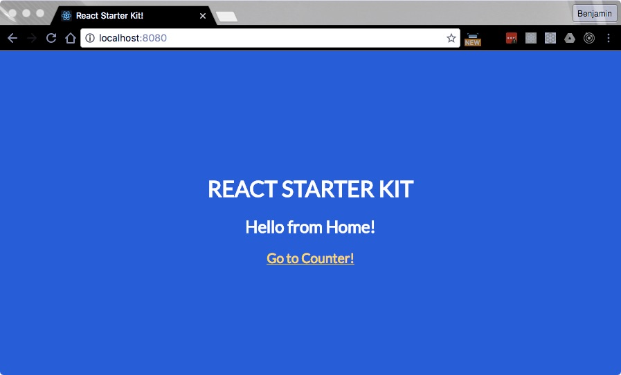

To recap, we have our project under source control with Git/GitHub, we're managing our dependencies with NPM, ESLint is configured to ensure code consistency, and Webpack is configured for development and production.

I just realized I didn't put a single GIF or meme in the last post so we'll start with one to balance things out.


## 7. React and React Router
Per the React site, React makes it painless to create interactive UIs.  That is no understatement.  React is all *component* based (you can think of them as widgets of functionality) meaning you break your UI into separate components and *compose* your UI from those pieces.  I highly recommend reading [Thinking in React](https://facebook.github.io/react/docs/thinking-in-react.html) by [Pete Hunt](https://twitter.com/floydophone) for a quick overview of using React.

Go ahead and install React and related packages.

```bash
npm install --save react react-dom
npm install --save-dev react-hot-loader@3.0.0-beta.2
```

##### What did we just install?
- `react`: React.js
- `react-dom`: React package for working with the DOM
- `react-hot-loader`: HMR with React in mind...we're using a beta version for compatibility with functional stateless components

We'll start by making the necessary config changes to get `react-hot-loader` working, then we'll create our first React component.

Update the very bottom of your "webpack.config.js" file as shown below.

```javascript
// ...more config
{
  // add HMR
  webpackConfig.entry.app.unshift(
    'react-hot-loader/patch', // this is new
    `webpack-dev-server/client?http://${config.host}:${config.port}`,
    'webpack/hot/only-dev-server'
  );
  webpackConfig.plugins.push(
    new webpack.HotModuleReplacementPlugin()
  );
}
```

Add a new `plugins` section to your ".babelrc" to enable `react-hot-loader`.

```json
{
  "presets": [["es2015", { "modules": false }], "react", "stage-0"],
  "plugins": ["react-hot-loader/babel"]
}
```

Update your "index.js" file as shown below.  Also, go ahead and delete "setHTML.js", "classes.scss", and the line `<input type="text" />` from "index.html".

```javascript
import React from 'react';
import { render } from 'react-dom';
import HomeContainer from './containers/Home/HomeContainer';

const MOUNT_NODE = document.getElementById('root');
const App = (
  <HomeContainer />
);

render(App, MOUNT_NODE);

```

That weird looking syntax (`<HomeContainer />`) is JSX, it's just JavaScript in disguise.  You can read more [here](https://facebook.github.io/react/docs/jsx-in-depth.html) where they give before and after code examples.

##### What's going on here?
- `React`: required to be in scope when using JSX
- `render`: a function provided by the `react-dom` library which is used to inject our root component into the DOM
- `HomeContainer`: the first React component we'll build momentarily
- `MOUNT_NODE`: reference to our "root" `div`
- `App`: our application...we'll be adding to this a little later
- `render()`: render our app into the DOM

#### Container vs. Presentational
If you looked closely at the `HomeContainer` import it is referencing a component in a sibling folder named "containers".  There's a useful philosophy in the React community of splitting up your components into two groups: container and presentational components (smart and dumb).

Basically, container components implement business logic and presentational components are only concerned with rendering the UI.  Dan Abramov has a good [post](https://medium.com/@dan_abramov/smart-and-dumb-components-7ca2f9a7c7d0#.f4mqb6y14) on the concepts.

Next, create two new folders under "src" named "containers" and "components" where we'll put our two types of components.  Then create a "Home" directory under the "containers" folder and a "HomeContainer.js" file in that directory, finally paste in the code below.  We'll follow a convention of appending "Container" to our container component names for clarity and to avoid naming collisions with our presentational components.

We'll create our first presentational component a little later, for now this will work as a starting point.

```javascript
import React from 'react';

const HomeContainer = () => (
  <h2>Hello from Home!</h2>
);

export default HomeContainer;

```

If you fire up your dev server you'll see your first React component in action!  Not very exciting, but we *are* using React now.

#### How can we create components?
If you read through [Thinking in React](https://facebook.github.io/react/docs/thinking-in-react.html) you would have seen components written by calling `React.createClass` (as of this writing anyway) rather than how we're doing it above.  There are actually three way to create components in React, the first of which follows.

```javascript
var HomeContainer = React.createClass({})
```

The second way you can create components is using [ES6 classes](https://developer.mozilla.org/en-US/docs/Web/JavaScript/Reference/Classes).

```javascript
class HomeContainer extends React.Component {}
```

Finally, you can create [functional stateless components](https://facebook.github.io/react/docs/reusable-components.html#stateless-functions).  There are certain limitations to this approach, but they're also simpler and Facebook has [stated](https://github.com/facebook/react/issues/5677) that they're planning future optimizations for components written in this way.  Stateless functions cannot use component lifecycle hooks or internal state (hence, stateless).  

We'll look at some of the lifecycle hooks in a later post when we cover Redux.  Stateless components are just implemented as a regular JavaScript functions.

```javascript
function HomeContainer() {}
// or
const HomeContainer = () => {}
```

#### React Hot Loader
When we updated our "index.js" file earlier we broken HMR.  Let's fix that now.

```javascript
import React from 'react';
import { render } from 'react-dom';
import { AppContainer } from 'react-hot-loader'; // eslint-disable-line
import HomeContainer from './containers/Home/HomeContainer';

const MOUNT_NODE = document.getElementById('root');
const App = (
  <HomeContainer />
);

render(App, MOUNT_NODE);

if (module.hot) {
  module.hot.accept('./containers/Home/HomeContainer', () => {
    render(<AppContainer>{App}</AppContainer>, MOUNT_NODE);
  });
}

```

The only big difference between how we were using HMR before and using it with `react-hot-loader` is the use of `AppContainer` when applying updates.  This component hasn't received documentation yet, nor have I dug into the code thoroughly to explain it.  For now, just know its use is required by `react-hot-loader`.

We're also overriding ESLint on line 3 to avoid a rule that we otherwise want applied.

#### Props
React enables you to pass data from parent components to child components via a `props` object.  Let's demonstrate that and also create our first presentational component.  Update/create the files below.

```javascript
// containers/Home/HomeContainer.js
import React from 'react';
import Home from '../../components/Home/Home';

const HomeContainer = () => (
  <Home message="Hello from HomeContainer!" />
);

export default HomeContainer;

```

```javascript
// components/Home/Home.js
import React from 'react';

const Home = (props) => (
  <div>
    <h2>Hello from Home!</h2>
    <div>{props.message}</div>
  </div>
);

Home.propTypes = {
  message: React.PropTypes.string.isRequired
};

export default Home;

```

##### HomeContainer
- We're importing our `Home` presentational component from components/Home...the reason we've nested it inside a "Home" directory is so we can create SASS files beside the JS file.
- When we render the `Home` component, we're passing a `message` property to it of "Hello from HomeContainer!".

##### Home
- We're rendering output similar to what we had before in `HomeContainer`, but we're also now rendering the message property passed in from `HomeContainer` in `<div>{props.message}</div>`.  React will replace `props.message` with "Hello from HomeContainer!" in the rendered output.
- Further down we're explicitly telling our component what `props` to expect with the `React.PropTypes` object.  Adding static typing and making `props` required can improve debugging during development.

If you view your app now, you should see two lines rendered.

> We'll look at `state` and `context`, two more fundamental React concepts, when we get to the post on Redux.

#### React Router
To make our app more interesting and useful we're going to add a router that enables us to change paths/routes within our app (e.g., my.site.com --> my.site.com/counter).  React Router interfaces with the HTML5 [history API](https://developer.mozilla.org/en-US/docs/Web/API/History) which works well with single page apps.

Let's get the library.

```javascript
npm install --save react-router
```

Update "index.js" as follows.

```javascript
import React from 'react';
import { render } from 'react-dom';
import { AppContainer } from 'react-hot-loader'; // eslint-disable-line
import { browserHistory, Route, Router } from 'react-router';
import HomeContainer from './containers/Home/HomeContainer';

const MOUNT_NODE = document.getElementById('root');
const App = (
  <Router history={browserHistory}>
    <Route path="/" component={HomeContainer} />
  </Router>
);

render(App, MOUNT_NODE);

if (module.hot) {
  module.hot.accept('./containers/Home/HomeContainer', () => {
    render(<AppContainer>{App}</AppContainer>, MOUNT_NODE);
  });
}

```

##### What's going on here?
- React Router imports
 - `browserHistory`: use the HTML5 history api for the router's history
 - `Route`: an individual React route component
 - `Router`: our React router component which controls/maintains our navigation and history
- We've updated `App` with a `Router` component and nested a `Route` component inside.  Here we're telling React to render a `Router` that uses `browserHistory` and create a single `Route` at path `"/"` (which is just our root route) that renders our `HomeContainer` component.

If you refresh your browser now nothing should look different, but it *is*.  Let's add another route to demonstrate.  Below our existing route add `<Route path="/counter" component={CounterContainer} />` and add `import CounterContainer from './containers/Counter/CounterContainer';` below your `HomeContainer` import.  Finally, create the components below.

```javascript
// containers/Counter/CounterContainer.js
import React from 'react';
import Counter from '../../components/Counter/Counter';

const CounterContainer = () => (
  <Counter />
);

export default CounterContainer;

```

```javascript
// components/Counter/Counter.js
import React from 'react';

const Counter = () => (
  <h2>Hello from Counter!</h2>
);

export default Counter;

```

Restart your server and try to visit "localhost:8080/counter".  Did you get a "Cannot GET /counter" error?  Me too.  

The reason this is happening is because we don't have a file in our "dist" directory named "counter".  What we want is for our server to always serve our "index.html" file when it doesn't find what it is looking for (an HTTP 404 error).  Webpack has this covered!  Add `historyApiFallback: true,` to the `devServer` section of your "webpack.config.js" file, restart your server, then visit "localhost:8080/counter" again.  It works!

If you visit localhost:8080 you'll continue to receive our `HomeContainer` output.  Wouldn't it be even better if we could navigate between our routes without having to manually change the URL?  Let's do that.  (We're also going to remove `props.message` from `HomeContainer` and `Home`)

```javascript
// containers/Home/HomeContainer.js
import React from 'react';
import Home from '../../components/Home/Home';

const HomeContainer = () => (
  <Home />
);

export default HomeContainer;

```

```javascript
// components/Home/Home.js
import React from 'react';
import { Link } from 'react-router';

// we've removed our message as well
const Home = () => (
  <div>
    <h2>Hello from Home!</h2>
    <Link to="/counter">Go to Counter!</Link>
  </div>
);

export default Home;

```

```javascript
// components/Counter/Counter.js
import React from 'react';
import { Link } from 'react-router';

const Counter = () => (
  <div>
    <h2>Hello from Counter!</h2>
    <Link to="/">Go Home!</Link>
  </div>
);

export default Counter;

```

Here we're using React Router `Link` components to navigate between our routes.  You should now be able to navigate back and forth between the two routes.

#### Layout Component
At this point our HMR is broken.  It works for our Home components, but not our Counter components.  We're going to fix it, but let's add a little consistency across our routes with a `Layout` component first.  

This is where you would typically find a navigation bar and footer among other things.  Create a new file named "Layout.js" in components/Layout with the code below.

```javascript
import React, { PropTypes } from 'react';

const Layout = (props) => (
  <div>
    <div>
      <h1>React Starter Kit</h1>
      {props.children}
    </div>
  </div>
);

Layout.propTypes = {
  children: PropTypes.node.isRequired
};

export default Layout;

```

`props.children` are any nodes (React components or regular HTML elements) rendered within a component such as `<Parent><Child /></Parent>`.  If you're wondering why there's an extra `div` in there, we'll need it later when we add some styling.

#### Routes
We've got our `Layout` component in good order, but we want to make one more change first.  We're going to break our routes out into a separate file beside our "index.js".  Create the file below.

```javascript
// src/routes.js
import React from 'react';
import { IndexRoute, Route } from 'react-router';
import Layout from './components/Layout/Layout';
import HomeContainer from './containers/Home/HomeContainer';
import CounterContainer from './containers/Counter/CounterContainer';

const routes = (
  <Route path="/" component={Layout}>
    <IndexRoute component={HomeContainer} />
    <Route path="/counter" component={CounterContainer} />
  </Route>
);

export default routes;

```

We're now rendering our `Layout` component at the "/" path and our `HomeContainer` is rendered into a new `IndexRoute` component.  React Router will render the `HomeContainer` component as the child when at the "/" route.

Finally, update your "index.js" file as shown below.

```javascript
import React from 'react';
import { render } from 'react-dom';
import { AppContainer } from 'react-hot-loader'; // eslint-disable-line
import { browserHistory, Router } from 'react-router';
import routes from './routes';

const MOUNT_NODE = document.getElementById('root');
const App = (
  <Router history={browserHistory}>
    {routes}
  </Router>
);

render(App, MOUNT_NODE);

if (module.hot) {
  module.hot.accept('./routes', () => {
    render(<AppContainer>{App}</AppContainer>, MOUNT_NODE);
  });
}

```

HMR is now fixed and we have a layout for consistency between our routes.

#### Adding Some Style


Our app looks awful so let's add a little CSS to make it look slightly better.  Create a new file named "Layout.scss" in the "Layout" folder as shown below.  Then add the class to the root `div` of your `Layout` component.

```css
.layout {
  /* colors */
  background-color: #3949ab;
  color: #fff;

  /* layout */
  display: flex;
  align-items: center;
  justify-content: center;

  /* fill width and height */
  position: absolute;
  top: 0;
  left: 0;
  height: 100%;
  width: 100%;

  /* font */
  font-family: 'Lato';
  text-align: center;

  /* make layout header uppercase */
  h1 {
    text-transform: uppercase;
  }

  /* make link yellow and little bigger */
  a {
    color: #fdd835 !important;
    font-size: 1.2rem;
  }
}
```

```javascript
// components/Layout.js
import React, { PropTypes } from 'react';
import classes from './Layout.scss';

const Layout = (props) => (
  <div className={classes.layout}>
    <div>
      <h1>React Starter Kit</h1>
      {props.children}
    </div>
  </div>
);

Layout.propTypes = {
  children: PropTypes.node.isRequired
};

export default Layout;

```

#### Better Font
Add `<link href="https://fonts.googleapis.com/css?family=Lato" rel="stylesheet">` between the `<head>` tags in your "index.html" file.  This will download our Lato font we used in our SASS file.

Does your app look like this?  Spectacular I must say.



#### Commit our changes

Let's commit and close our next GitHub issue.

```bash
git add .
git commit -m 'added React and React Router...closes #5'
git push origin master
```

#### Summary
We now have React and React Router setup which lets us modularize the functionality of our app into multiple components as well as break our app up into separate routes for a better use experience.  In the next section we'll get our testing setup in place so we can take a [Test Driven Development (TDD)](https://en.wikipedia.org/wiki/Test-driven_development) approach with the rest of our components.
