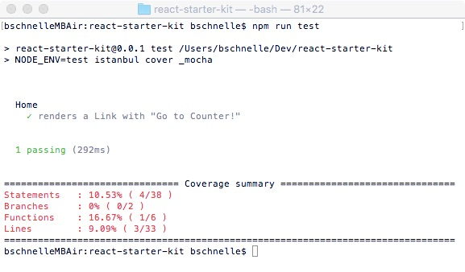

In the last part we setup React and React Router, now we're going to look at how we can test our application.

## 8. Testing Setup
What is a test?  It's a way for us to make assertions about the expected behavior of our application and then verify that those assertions hold based on the behavior of the application.

Why write tests for our application?  Isn't it just doubling our work?  

Once our code has been tested we can make changes to it, rerun the tests, and if they all pass it gives us a reasonable amount of confidence that we didn't break anything.  Tests give you organization and force you to put more thought into what you're going to be building ahead of time.  [This](http://stackoverflow.com/a/67500/2482993) StackOverflow answer does a great job of summarizing the benefits of testing.  

Convinced?  Me too.

##### Here's a recap of the tools we'll be using.
- [Mocha](https://mochajs.org/): testing framework/test runner
- [Chai](http://chaijs.com/): test assertions
- [Sinon](http://sinonjs.org/): spies, stubs, and mocks (helpers that making testing easier)
- [Enzyme](http://airbnb.io/enzyme/): Airbnb powered React specific testing utilities
- [JSDom](https://github.com/tmpvar/jsdom): a JavaScript implementation of the DOM
- [Istanbul](https://github.com/gotwarlost/istanbul): code coverage...how much of our code has been tested?

Installation!

```bash
npm install --save mocha chai chai-immutable sinon sinon-chai enzyme react-addons-test-utils jsdom istanbul@1.1.0-alpha.1
```

Whoa, wait a second, you slipped three extra libraries in there.  `chai-immutable` lets us make assertions when using Immutable.js (to be added a little later) and `sinon-chai` lets us make more elegant assertions when using `sinon`.  `react-addons-test-utils` is required for `enzyme`.

#### Initial Setup
Go ahead and create a "test" folder in the root of your project then create "setup.js" in it.  Paste in the code below.

```javascript
import { jsdom } from 'jsdom';
import chai from 'chai';
import chaiImmutable from 'chai-immutable';
import sinonChai from 'sinon-chai';

// create a fake DOM (browser) in memory
global.document = jsdom('');
global.window = document.defaultView;

Object.keys(window).forEach((key) => {
  if (!(key in global)) {
    global[key] = window[key];
  }
});

// add chai plugins
chai.use(chaiImmutable);
chai.use(sinonChai);

```

The code above creates a fake DOM so that we can test our client code on the server (without a browser).  If you wanted you could also run your test suite from one or more browsers, but it is generally less efficient.  It then creates all of the global variables you would typically find in a browser based JavaScript environment.  At the bottom of the file we're adding our Chai plugins.

#### Mocha Config
Next we need to provide a few config options to Mocha, our testing framework.  Create a file named "mocha.opts" in the "test" directory.

```
--compilers js:babel-core/register
--require test/setup.js
test/**/*.spec.js
```

##### What are these options doing?
- `compilers` tell Mocha to use `babel-core/register` to transpile ".js" files to ES5 prior to running tests (remember in the testing context Webpack won't be doing anything for us, but we still need to convert our files written in ES6/ES7/JSX to ES5)
- the `require` option is telling Mocha to run the "setup.js" file prior to running the tests
- the last option is a [glob](https://github.com/isaacs/node-glob) which tells Mocha what files to execute as tests...here we're saying find any tests in the "test" directory, at any depth, that end in ".spec.js".

#### Babel
We need to make a change to our ".babelrc" file as shown below.  We've added a new `env` section that will determine which options to use based on the value of `process.env.NODE_ENV`.  

Here we're using `react-hot-loader` in "development", disabling CommonJS modules in "production", and doing neither in "test".

```json
{
  "env": {
    "development": {
      "presets": ["es2015", "react", "stage-0"],
      "plugins": ["react-hot-loader/babel"]
    },
    "production": {
      "presets": [["es2015", { "modules": false }], "react", "stage-0"]
    },
    "test": {
      "presets": ["es2015", "react", "stage-0"]
    }
  }
}
```

#### ESLint
Given our new testing context, we need to modify a few ESLint rules so that we aren't dealing with linting errors constantly.  Create a new ".eslintrc" file in the "test" folder.

```javascript
{
  "env": {
    "mocha": true
  },
  "extends" : "../.eslintrc",
  "rules": {
    "no-unused-expressions": 0
  }
}
```

Here we're extending our existing ESLint config, setting our environment to Mocha (for certain global variables), and ignoring the "no-unused-expressions" rule that would throw errors on some of our assertions with Chai.

#### Istanbul
One final config file we need is ".istanbul.yml" at the *root* of our project as shown below.  This file tells Istanbul that the files we want to test are in our "src" directory and to include all files JavaScript anywhere in that directory when determining code coverage.

```yml
instrumentation:
  root: src
  include-all-sources: true
```

#### Scripts
We have all of our config files in place, now we just need to add a few new scripts to our "package.json" file to make testing easier.  Add the three lines below to the `scripts` section of your "package.json".  You can delete the placeholder `test` script that was already in there.

```json
{
  "test": "NODE_ENV=test mocha",
  "test:cover": "NODE_ENV=test istanbul cover _mocha",
  "test:dev": "npm run test -- --watch"
}
```

> Why are we using `_mocha` instead of `mocha` in `test:cover`? See [here](https://github.com/gotwarlost/istanbul/issues/44#issuecomment-16093330)

Now we have three testing options: run tests, run tests and generate a code coverage report (we'll see this in a bit), and run tests then rerun them anytime a file is changed (`-- --watch` passes the watch flag to `mocha`).

#### Let's create our first test!  

We'll mirror our "src" directory structure in our "test" directory with test files corresponding to all source files.  Create the directories necessary and file at "test/components/Blog/Blog.spec.js".  The ".spec.js" extension is just a testing convention.

```javascript
import React from 'react';
import { expect } from 'chai';
import { shallow } from 'enzyme';
import { Link } from 'react-router';
import Blog from '../../../src/components/Blog/Blog';

describe('Blog', () => {
  it('renders a Link with "Go Home!"', () => {
    const wrapper = shallow(<Blog />);
    expect(wrapper.contains(<Link to="/">Go Home!</Link>)).to.be.true;
  });
});

```

Here we're using `shallow` rendering which only renders a component one level deep.  So in this case the `Link` component is not actually evaluated so we can test that the rendered output contains `<Link to="/">Go Home!</Link>` which is exactly what we're doing above.  The `describe` block provides scoping and context, the `it` block is the actual test, and `expect` provides our assertion.  Depending on the outcome of our assertion the test passes or fails.

#### Code Coverage
Jump over to the terminal and run `npm run test:cover` which will execute our test and generate a code coverage report (directory) in the root of your project called "coverage".  Your command line output should look similar to the image below.



Before we go any further lets add that directory to our ".gitignore" file so we don't accidentally commit it.

Our code coverage is looking pretty crummy at under 14%, let's take a closer look.  Open up the "index.html" file in coverage/lcov-report.  It should look similar to the image below.  You can explore your source files to see which are tested and which aren't.  Later we'll get our coverage up to 100%.


#### Reorganization
While having a separate directory for test files works and used to be my preference, I've since had a change of heart.  An alternative to this approach is to put our test files beside our source files, in the same directory.  I think this lends itself to more modular code and makes refactors simpler as we're not maintaining two directories that mirror one another.  

This is strictly personal preference and if you prefer the approach we've already taken you can skip the following changes.

Update your "mocha.opts" file as shown below to find our ".spec.js" files in our "src" directory.

```
--compilers js:babel-core/register
--require test/setup.js
src/**/*.spec.js
```

Delete the ".eslintrc" file in the "test" directory and update the ".eslintrc" file in the root of your project as shown below.  We've moved our test related config into our global ESLint config file so it will be applied to both our source and test files which isn't ideal.  Unfortunately, ESLint doesn't currently provide a way for us to apply rules based on file extension so this is as good as it gets for now.

```javascript
{
  "parser": "babel-eslint",
  "env": {
    "browser": true,
    "mocha": true // remove when eslint adds glob matching
  },
  "extends" : "airbnb",
  "rules": {
    "comma-dangle": 0,
    "no-unused-expressions": 0, // remove when eslint adds glob matching
    "react/jsx-filename-extension": 0
  }
}
```

Update your ".istanbul.yml" config file as shown below so that we don't include our ".spec.js" files when determining code coverage.

```yml
instrumentation:
  root: src
  include-all-sources: true
  excludes: ['*.spec.js']
```

Finally move the "Home.spec.js" file from test/components/Home to src/components/Home and update it as shown below.  Also, delete the "components" subdirectory of "test".

```javascript
import React from 'react';
import { expect } from 'chai';
import { shallow } from 'enzyme';
import { Link } from 'react-router';
import Blog from './Blog'; // update our import location

describe('Blog', () => {
  it('renders a Link with "Go Home!"', () => {
    const wrapper = shallow(<Blog />);
    expect(wrapper.contains(<Link to="/">Go Home!</Link>)).to.be.true;
  });
});

```

#### Commit our changes
Let's commit and close our next GitHub issue.

```bash
git add .
git commit -m 'added testing setup...closes #6'
git push origin master
```

#### Summary
Our testing setup is looking pretty good and we've written our first test.  Stellar progress!  Let's head to the next part where we'll see what Redux is all about.
