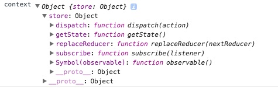
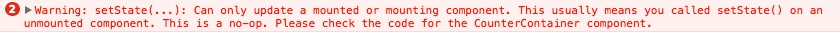

## 9. Redux
React has got our UI covered, but what about application [state](http://stackoverflow.com/a/8102731/2482993)?  How should we manage that?  [Redux](http://redux.js.org/)!

Redux is a simplified implementation of the [Flux](http://facebook.github.io/flux/), application pattern created/used by Facebook.  Flux and Redux take a different approach than more traditional design patterns like MVC ([client MVC](http://stackoverflow.com/questions/33447710/mvc-vs-flux-bidirectional-vs-unidirectional)).

Many client frameworks like Ember and Angular 1 implemented two-way data binding which means if you have (for example) a `Person` model with a `firstName` property that has been wired up to an `input` and you change the value of the `input` the `firstName` property of the `Person` is updated to that new value.  Similarly, if you were to update the `firstName` property on the model directly using JavaScript your `input` would reflect the new value as well, hence two-way.  This binding can be convenient and results in less boilerplate code, but there are also performance implications in complex applications and it can make reasoning about your app more difficult.

Redux takes a different approach (borrowing from Flux concepts) which makes it easier to reason about.  In Redux all state is maintained by a central `store` and your application can `subscribe` to changes so that anytime your state is changed in the `store` your application is notified and can respond accordingly.  So how do you actually change the data in the `store`?  You `dispatch` an `action` via the `store` which updates the state via a `reducer` which is a *pure* function (a function that doesn't have side effects...if you call it with the same arguments over and over it will always return the same value) that takes the old state + your `action` and returns the next state.  All data flow is one-way, meaning those changes you made to that `input` wouldn't update our `Person` unless you explicitly dispatch an `action` to do so.  We'll see how this all works below in the context of React, **BUT** you do **NOT** have to use Redux with React.  It can be used entirely on its own or with any other view library or you can write your own views using raw HTML and JavaScript.

Let's install the libraries we'll need.

```bash
npm install --save redux react-redux react-router-redux
```

##### What are those?
- `redux`: self-explanatory
- `react-redux`: bindings between React and Redux...remember how I said you need to `subscribe` to state changes in order to respond to them?  Well, this library provides an easy mechanism to do that for React components.  Via a `connect` function provided by `react-redux` you're able to bind Redux state and/or Redux action creators to component `props` (explained shortly).
- `react-router-redux`: remember our router from before? It keeps track of when we navigate around our app (such as going from "/" to "/blog") which is just part of our application state.  Since we're using Redux to manage all of our application state it would probably be smart to keep the two in sync, right?  This is especially helpful using a feature of Redux called "time-travel" which allows you to undo `actions` and essentially go back in time (we'll see this in practice in the next part).  If your `action` changed your route from "/" to "/blog" and you want to undo it `react-router` needs to know about it.  This library, `react-router-redux`, provides that for us.

Back in the initial discussion of React we mentioned a few concepts like `props`, `state`, and `context` that we would discuss in this post.  Let's do that now.  I've now mentioned `state` twice in two different contexts (not to be confused with React `context`)!  Make the changes below.

```javascript
// components/App.jsx
import React from 'react';
import { Link } from 'react-router';

export default class App extends React.Component {
  static propTypes = {
    linkMessage: React.PropTypes.string.isRequired,
  }

  render() {
    return <Link to="/blog">{this.props.linkMessage}</Link>;
  }
}

```

```javascript
// containers/App.jsx
import React from 'react';
import App from '../components/App';

export default class AppContainer extends React.Component {
  render() {
    const linkMessage = 'Go to Blog!';
    return <App linkMessage={linkMessage} />;
  }
}

```

Here we've updated our two App components so that the container is now passing down `props.linkMessage` to the presentational component which displays it.  You'll also notice in components/App.jsx that we're explicitly specifying `linkMessage` as a required string under `propTypes`.  This adds some nice type checking for us during development which can help us find bugs more quickly.

If we were to change the value of `linkMessage` in our container component our presentational component would rerender (by default) and display the new value.  Let's demonstrate how that would work.

```javascript
// components/App.jsx
import React from 'react';
import { Link } from 'react-router';

export default class App extends React.Component {
  static propTypes = {
    counter: React.PropTypes.number,
    increment: React.PropTypes.func.isRequired,
    linkMessage: React.PropTypes.string.isRequired,
  }

  render() {
    return (
      <div>
        <Link to="/blog">{this.props.linkMessage}</Link>
        <div>{this.props.counter}</div>
        <button onClick={this.props.increment}>Increment</button>
      </div>
    );
  }
}

```

```javascript
// containers/App.jsx
import React from 'react';
import App from '../components/App';

export default class AppContainer extends React.Component {
  constructor(props) {
    super(props);
    this.state = { counter: 0 };
    this.increment = this.increment.bind(this);
  }

  increment() {
    this.setState({ counter: this.state.counter + 1 });
  }

  render() {
    const linkMessage = 'Go to Blog!';
    return (
      <App
        counter={this.state.counter}
        increment={this.increment}
        linkMessage={linkMessage}
      />
    );
  }
}

```

Dang, things just got complicated.  Let's step through our changes.  In our presentational component we have two new `propTypes`: `increment` and `counter` which are a function and a number, respectively.  Then we're rendering the `Link` from before as well as a `div` with our `counter` number in it and finally a `button` which calls our `increment` property when clicked.

Our container component has even more going on.  There's a whole new `constructor` function which is called by our `AppContainer` when it is first initialized.  This function receives a `props` argument which is just an object containing all of the properties passed into this component.  If you were to inspect the `props` object you would see it contains several nested objects that are passed in by `react-router`.  We'll look at some of those later.  Because we have explicitly created a `constructor` function we first want to call any parent constructors with the `super` keyword (remember we're extending from `React.Component`).  The next line is initializing our component's local `state` (different from Redux state) which we'll use to track how many times our `increment` function is called (by clicking the button in our presentational component).  The final line in our constructor is binding our `increment` function to our `AppContainer` component so that when we pass it down to our `App` component it can call the function appropriately.  The `this` keyword in JavaScript can be confusing, if it is foreign to you I would suggest reading more [here](https://developer.mozilla.org/en-US/docs/Web/JavaScript/Reference/Operators/this).

Next, we have our `increment` function which calls a `setState` function that is inherited from `React.Component`.  `state` is a special object in React that when updated causes the component and any child components to rerender.  `setState` is how you update your `state`.  You **never** want to directly modify `state` with anything like `this.state.counter = 10;`, so anytime you want to update your `state` you'll want to create a new `state` or clone the existing state and update that.  Our `increment` function just grabs our existing `state.counter` and increments it by one each time.

Finally, you can see we're passing `state.counter` and `increment` to our presentational component so that it can use them in the UI.

Now what?  Well if you open up your browser to localhost:8080 again you should see a pretty ugly page with a link, a number, and a button.  If you click the button though, the number goes up by one.  Neat!

Now click your link to go to "/blog" then click the link there to come back to "/".  Our number went back to zero.  Shoot, we wanted to keep our hard work.  The reason it reset is that when you navigated to "/blog" our `AppContainer` was `unmounted` which removed it from the DOM and hence any data associated with it was lost.  Then when you went back to "/" it was recreated and the `counter` was reinitialized to zero.

There are situations where this is completely appropriate, but there are also situations where you want to persist your application state.  That's where Redux comes in.  Because we're going to be using Redux with React we need to first discuss `context` which can be thought of as implicit `props`.  It allows you to pass data from a parent component to a descendent, the number of levels deep doesn't matter.  This can be convenient when you don't want to explicitly pass it from component to component through `props` all the way down the chain, but it can also make it more difficult to reason about because of the fact that data is "magically" available.  We'll see `context` in action shortly.

#### Redux + React Redux (react-redux)
Open up your "index.jsx" file in "src" and make the changes below.

```javascript
import React from 'react';
import ReactDOM from 'react-dom';
import { createStore } from 'redux';
import { Provider } from 'react-redux';
import { browserHistory, Route, Router } from 'react-router';
import App from './containers/App';
import Blog from './containers/Blog';

const reducer = (state) => state;
const initialState = { counter: 10 };
const store = createStore(reducer, initialState);

ReactDOM.render((
  <Provider store={store}>
    <Router history={browserHistory}>
      <Route path="/" component={App} />
      <Route path="/blog" component={Blog} />
    </Router>
  </Provider>
), document.getElementById('root'));

```

Here we've added two new imports: `createStore` from `redux` and `Provider` from `react-redux`.  We're then creating a `reducer` that just returns the first argument passed to it and an `initialState` object for our `counter`.  Next we call `createStore` with our `reducer` and `initialState`.  What we have done is create a Redux store with a default state of `initialState` and a `reducer` that just returns our old state.  Later we'll update our `reducer` so it actually does something, but I wanted to start with a simple example to show how the Redux store is used in components.

Below we've wrapped our `Router` component with `Provider` and passed our store to it as a property.  Remember a little while ago when I talked about React `context`?  `context` is exactly how `Provider` passes the `store` down the component hierarchy enabling us to extract data (our `counter` value) at any depth we please.  Let's see how we would access our store.

```javascript
// containers/App.jsx

// ...dependencies
export default class AppContainer extends React.Component {
  static contextTypes = {
    store: React.PropTypes.object,
  }

  constructor(props, context) {
    super(props);
    this.state = { counter: context.store.getState().counter };
    this.increment = this.increment.bind(this);

    // delete this after you have a chance to see what context/store look like
    console.log('context', context);
  }

  // increment & render...
}

```

What have we changed?  So we added a `contextTypes` with a `store` property that looks just like `propTypes` on our presentational component.  That's because it *is* very similar...we're just defining our `context` instead of our `props`.  In our `constructor` we've added a new argument for `context` on which we're then calling `store.getState()` which returns the current state from the Redux `store`.  Finally, we're accessing the `counter` property on that state.  A little further down we've added a `console.log` statement so that we can inspect the `context` object, specifically the `store` property.  If you view it in your Chrome developer tools you should see an object that looks like the one below.  



We're concerned with three functions exposed on the `store` object: `dispatch`, `getState`, and `subscribe`.  `dispatch` is how we tell the `store` to update the state, we already discussed `getState`, and `subscribe` is how we listen for changes in the `store`.

If you look at our app now you'll notice that our `counter` starts at 10 because that's the default value in our Redux store.  Click the button a few times and you'll see your number increment as before, then click the link to leave the page and come back again.  We're back to 10...dammit.  We have the same issue as before because our `increment` function is updating the local component `state` rather than the Redux `store`.  

How do we update the Redux store `counter`?  Our `reducer` of course!  Time to make our `reducer` actually do something.  Update it in "index.jsx" as shown below.

```javascript
{
  const reducer = (state, action) => {
    if (action.type === 'INCREMENT') {
      return { counter: state.counter + action.increment };
    }
    return state;
  };
}
```

We've added a new `action` argument to our `reducer` which the function will receive anytime we call `dispatch` with an `action` object as you'll see momentarily.  If `action.type` equals "INCREMENT" then return a new object with `counter` set to its old value plus `action.increment`, otherwise return the old `state`.

Let's update our `AppContainer`'s `increment` function to dispatch an "INCREMENT" action instead of updating its local `state`.

```javascript
{
  // ...constructor

  componentWillMount() {
    this.context.store.subscribe(() => {
      this.setState({ counter: this.context.store.getState().counter });
    });
  }

  increment() {
    const action = { type: 'INCREMENT', increment: 2 };
    this.context.store.dispatch(action);
  }

  // render...
}
```

Here we've made two changes.  Let's look at `increment` first.  Instead of updating `AppContainer`'s local `state` with `setState` we're now creating an `action` of `type` "INCREMENT" and setting `increment` to 2.  `componentWillMount` is a component lifecycle hook that allows us to run code at certain times during the component's lifecycle.  In this case `constructor` and `componentWillMount` are essentially identical, but I've separated them for clarity here.  Via the `subscribe` method on the `store` object we're able to respond to changes to our Redux store's `state`.  Here we're just updating our *local* `state.counter` to the corresponding property in our Redux store anytime the store is updated.

Fire up your app again if it isn't already running and increment our counter, then navigate between routes, and you should see it retain its value.  Awesome!  Increment it again after you switched routes and check the console, we have an error...shit.



Why are we getting this and what does it mean?  Well if we read it tells us exactly what the problem is.  We're calling `setState` on an unmounted component which is a no-no.  How is this happening?  Remember earlier when I said our component is unmounted when we change routes (which is why we were losing our `counter` state)?  Well that is still happening, but that listener we added to the Redux store with `subscribe` in our `componentWillMount` hook is still there long after our component unmounts.  So we need to `unsubscribe` from the store before our component unmounts.  How?

```javascript
// ...more stuff

componentWillMount() {
  this.unsubscribe = this.context.store.subscribe(() => {
    this.setState({ counter: this.context.store.getState().counter });
  });
}

componentWillUnmount() {
  this.unsubscribe();
}

// more stuff...
```

When we call `subscribe` it returns an `unsubscribe` object we can call to remove the listener from the store.  Simple as that.  `componentWillUnmount` is, you guessed it, another lifecycle hook.

Now increment all you want and click back and forth between routes.  No errors!

#### React Redux connect
If you're thinking there has to be a better way to go about getting data from the store, you would be correct.  I just wanted to show you how things are implemented manually first.

`react-redux` exposes a `connect` function in addition to the `Provider` component.  Let's see how we can simplify our component using that.

```javascript
// containers/App.jsx

import React from 'react';
import { connect } from 'react-redux';
import App from '../components/App';

class AppContainer extends React.Component {
  static propTypes = {
    counter: React.PropTypes.number.isRequired,
    increment: React.PropTypes.func.isRequired,
  }

  render() {
    const linkMessage = 'Go to Blog!';
    return (
      <App
        counter={this.props.counter}
        increment={this.props.increment}
        linkMessage={linkMessage}
      />
    );
  }
}

const stateToProps = (state) => ({ counter: state.counter });
const dispatchToProps = {
  increment: () => ({ type: 'INCREMENT', increment: 2 }),
};
export default connect(stateToProps, dispatchToProps)(AppContainer);

```

We're importing `connect` from `react-redux` and using it at the very bottom.  `connect` is what's known as a [higher order component](https://medium.com/@franleplant/react-higher-order-components-in-depth-cf9032ee6c3e#.70hzkn6mh) which is a component that wraps another component and augments it with new `props`.  All of the interactions we were doing with `context` are handled by `connect` for us now, we just have to tell `connect` what data we want from the `store` and what actions we want to be able to `dispatch`.  It then maps those pieces of state and action creators to `props` on our component.  

`connect` accepts two main arguments `mapStateToProps` and `mapDispatchToProps` (we've abbreviated slightly).  The first is how we access data from the `store` and the `second` is how we `dispatch` actions to the store.  We've created two `props`: `counter` and `increment`.  Now when we call `this.props.increment` it will update the `counter` property in Redux, then pass the updated value to our components as `this.props.counter` and we just pass that along to our presentational component for rendering.  Much more elegant.

#### Misc
Update/create the files below and then we'll discuss what we've done here.

```javascript
// src/index.jsx

import React from 'react';
import ReactDOM from 'react-dom';
import { Provider } from 'react-redux';
import { browserHistory, Route, Router } from 'react-router';
import { syncHistoryWithStore } from 'react-router-redux';
import store from './redux/store';
import App from './containers/App';
import Blog from './containers/Blog';

const history = syncHistoryWithStore(browserHistory, store);

ReactDOM.render((
  <Provider store={store}>
    <Router history={history}>
      <Route path="/" component={App} />
      <Route path="/blog" component={Blog} />
    </Router>
  </Provider>
), document.getElementById('root'));

```

```javascript
// src/redux/modules/home/index.js

// Actions
const INCREMENT = 'benjaminschnelle.com/home/INCREMENT';

// Reducer
export default (state = { counter: 10 }, action) => {
  if (action.type === INCREMENT) {
    return { counter: state.counter + action.increment };
  }
  return state;
};

// Action Creators
export function increment() {
  return { type: INCREMENT, increment: 2 };
}

```

```javascript
// src/redux/reducer.js

import { combineReducers } from 'redux';
import { routerReducer } from 'react-router-redux';

import home from './modules/home';

export default combineReducers({
  home,
  routing: routerReducer,
});

```

```javascript
// src/redux/store.js

import { createStore } from 'redux';
import reducer from './reducer';

export default createStore(reducer);

```

```javascript
// src/containers/App.jsx

import React from 'react';
import { connect } from 'react-redux';
import { increment } from '../redux/modules/home';
import App from '../components/App';

class AppContainer extends React.Component {
  static propTypes = {
    counter: React.PropTypes.number.isRequired,
    increment: React.PropTypes.func.isRequired,
  }

  render() {
    const linkMessage = 'Go to Blog!';
    return (
      <App
        counter={this.props.counter}
        increment={this.props.increment}
        linkMessage={linkMessage}
      />
    );
  }
}

const stateToProps = (state) => ({ counter: state.home.counter });
const dispatchToProps = { increment };

export default connect(stateToProps, dispatchToProps)(AppContainer);

```

In src/index.jsx we've moved our `reducer` and `store` into external files and we're now creating a `history` object.  If you remember earlier when we talked about `react-router-redux` we said we needed to sync `react-router` with `redux` which is what we're doing here.  We then pass `history` to our `Router` instead of our raw `browserHistory` object.

Next we've created a new "redux" directory.  We'll put all of our Redux related code in here to keep things better organized.  

Nested in this folder is another named "modules" which is where we'll keep all of our reducers (we'll combine multiple reducers into a single one we pass to the `store`).  Additionally, we'll keep our action definitions (`INCREMENT`), and our action creators (`increment`), in the same directory.  This approach was suggested by Erik Rasmussen, which he calls [Ducks](https://github.com/erikras/ducks-modular-redux).  The reason we've nested the file in a directory ("home") is so that if the file gets unruly we can split it up into multiple files without changing our imports all over our codebase.  The action definition is scoped so that we don't run into conflicts with our action dispatching libraries.  You can also see in our `reducer` that we're now applying our `initialState` as a default value to the `state` argument (`state = { counter: 10 }`).  We also have a new action creator called `increment` that we can import anywhere in our code where we want to increment our counter (in case we wanted to do that in multiple places).

The next new file is src/redux/reducer.js which is where we'll be combining all of our reducers into a single `reducer`.  You'll notice another import from `react-router-redux` of `routerReducer` which is also necessary to sync `react-router` with `redux`.  One other thing to note is that we're now putting our old reducer on a new `home` key.  The Redux `combineReducers` function is self-explanatory.

In src/redux/store.js we're just creating our `store` as before using our new, combined `reducer`.

Finally, we make the necessary changes to get `AppContainer` working again.  We now need to map `state.home.counter` to our `props` instead of `state.counter`.  We also import our `increment` action creator from our "home" "Duck" rather than defining it locally.

...Well that took longer than I anticipated.  

Let's commit and close our next GitHub issue.

```bash
git add .
git commit -m 'added Redux...closes #7'
git push origin master
```

#### Summary
We've got our Redux store all setup now and ready to hold our application state.  Next we'll look at Immutable.js and the benefits it brings to the table.
